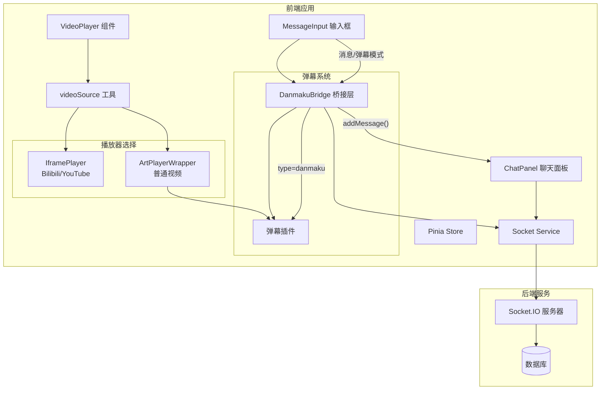

# WatchTogether - ArtPlayer 集成架构设计

## 1. 概述

本文档为 WatchTogether 平台集成 ArtPlayer 播放器并实现聊天-弹幕双向同步提供详细架构设计。

**目标**：
- 集成 ArtPlayer 替代原生 video 元素
- 支持外部网站视频嵌入（Bilibili、YouTube）
- 实现弹幕功能（发送、显示、同步）
- 实现聊天-弹幕双向同步（聊天消息可转发为弹幕，弹幕可同时显示在聊天列表）
- 保持现有视频同步功能不受影响
- 视频名称显示在页面顶部

## 2. 技术选型

### 2.1 选择 ArtPlayer

| 方案 | 维护状态 | 弹幕能力 | Vue3 兼容 | 评估 |
|------|----------|----------|-----------|------|
| **ArtPlayer** | 活跃 (2025) | 内置弹幕插件，API 成熟 | 良好 | ✅ **推荐** |
| DPlayer | 停止维护 (~2020) | 功能完整 | 一般 | ❌ 放弃 |
| xgplayer | 活跃 (字节) | 弹幕有 bug | 良好 | ⚠️ 次选 |

**选择理由**：
- GitHub 4.2K stars，持续维护
- `artplayer-plugin-danmuku` 弹幕插件成熟
- 支持动态发送弹幕：`art.plugins.artplayerPluginDanmuku.send()`
- 支持 Promise 异步加载弹幕数据
- 体积适中，功能完整

### 2.2 依赖

```json
{
  "dependencies": {
    "artplayer": "^5.2.0",
    "artplayer-plugin-danmuku": "^1.0.0"
  }
}
```

## 3. 当前架构分析

### 3.1 现有组件结构

```
frontend/src/
├── components/
│   ├── video/
│   │   ├── VideoPlayer.vue       # 视频播放器（原生 video）
│   │   └── VideoControls.vue     # 视频控制条
│   └── chat/
│       ├── ChatPanel.vue         # 聊天面板
│       ├── MessageInput.vue      # 消息输入
│       └── MessageList.vue       # 消息列表
├── services/
│   └── socket.js                 # Socket.IO 服务
├── stores/
│   ├── room.js                   # 房间状态（含 videoState）
│   └── chat.js                   # 聊天状态
└── utils/
    └── (待添加)                   # 工具函数
```

### 3.2 现有 Socket 事件

| 事件 | 方向 | 用途 |
|------|------|------|
| `video:play` | 客户端 → 服务器 | 视频播放 |
| `video:pause` | 客户端 → 服务器 | 视频暂停 |
| `video:seek` | 客户端 → 服务器 | 视频跳转 |
| `video:sync-*` | 服务器 → 客户端 | 同步广播 |
| `chat:message` | 双向 | 聊天消息 |

### 3.3 现有 ChatMessageEvent 结构

```java
// 后端已存在的事件结构
public class ChatMessageEvent {
    private String roomId;
    private String content;
    private String type;        // "text", "image" - 可扩展为 "danmaku"
    private String senderId;
    private String senderNickname;
    private Long timestamp;
}
```

**关键发现**：后端 `type` 字段已存在，可直接复用，无需后端改动。

## 4. 系统架构设计

### 4.1 高层架构



### 4.2 核心设计原则

1. **双播放器架构**：
   - 外部网站（Bilibili、YouTube）使用 iframe 嵌入，禁用弹幕
   - 普通视频文件使用 ArtPlayer 播放器，启用弹幕
2. **事件复用**：复用现有 `chat:message` 事件，通过 `type` 字段区分消息类型
3. **单向数据流**：弹幕通过 Socket 广播，所有客户端同步显示
4. **关注点分离**：播放器逻辑、弹幕逻辑、聊天逻辑分离
5. **向后兼容**：不破坏现有视频同步和聊天功能

### 4.3 视频源识别

**支持的视频源类型**：

| 源类型 | 检测规则 | 播放器 | 弹幕支持 |
|--------|----------|--------|----------|
| Bilibili | `bilibili.com/video/BV...` 或 `b23.tv/...` | iframe | 否 |
| YouTube | `youtube.com/watch?v=...` 或 `youtu.be/...` | iframe | 否 |
| 普通视频 | 其他URL（.mp4/.webm等） | ArtPlayer | 是 |

**视频名称提取**：
- Bilibili: `Bilibili: BVxxx`
- YouTube: `YouTube: 视频ID`
- 普通视频: 从URL提取文件名

### 4.3 关键设计决策

**决策 1：复用 chat:message 事件而非新增事件**
- 理由：后端 ChatMessageEvent 已有 type 字段，可直接扩展
- 优势：后端零改动，降低联调成本
- 实现：`type: 'danmaku'` 标识弹幕消息

**决策 2：新增 DanmakuBridge 组件**
- 理由：解耦聊天和弹幕逻辑，避免 ChatPanel 和 ArtPlayer 直接耦合
- 职责：监听 Socket 消息，桥接聊天-弹幕双向同步
- 位置：RoomView.vue 中，作为独立组件

**决策 3：保留 VideoControls 组件**
- 理由：减少改动范围，降低风险
- 实现：ArtPlayer 隐藏默认控制条，使用现有 VideoControls

## 5. 组件设计

### 5.1 新组件结构

```
components/video/
├── VideoPlayer.vue          # 重构：播放器入口，根据源类型选择播放器
├── ArtPlayerWrapper.vue     # 新增：ArtPlayer 封装组件（支持弹幕）
├── IframePlayer.vue         # 新增：iframe 嵌入播放器（无弹幕）
├── VideoControls.vue        # 保持不变
└── DanmakuBridge.vue        # 新增：聊天-弹幕桥接组件

components/chat/
├── ChatPanel.vue           # 修改：集成桥接层
├── MessageInput.vue        # 修改：支持弹幕模式切换
└── MessageList.vue          # 保持不变

utils/
└── videoSource.js          # 新增：视频源识别工具
```

### 5.2 videoSource.js - 视频源识别工具

职责：识别视频URL类型，返回播放器类型和嵌入URL。

```javascript
export function detectVideoSource(url) {
  if (!url) return { type: 'none', name: null, embedUrl: null }
  
  // Bilibili 检测
  // 支持格式：
  // - https://www.bilibili.com/video/BVxxx
  // - https://b23.tv/xxx (短链接，需要API转换，暂不支持)
  const biliMatch = url.match(/bilibili\.com\/video\/(BV[\w]+)/i)
  if (biliMatch) {
    return {
      type: 'bilibili',
      name: `Bilibili: ${biliMatch[1]}`,
      embedUrl: `//player.bilibili.com/player.html?bvid=${biliMatch[1]}&high_quality=1&danmaku=0`,
      supportsDanmaku: false
    }
  }
  
  // YouTube 检测
  // 支持格式：
  // - https://www.youtube.com/watch?v=xxx
  // - https://youtu.be/xxx
  const ytMatch = url.match(/(?:youtube\.com\/watch\?v=|youtu\.be\/)([\w-]+)/i)
  if (ytMatch) {
    return {
      type: 'youtube',
      name: `YouTube: ${ytMatch[1]}`,
      embedUrl: `https://www.youtube.com/embed/${ytMatch[1]}`,
      supportsDanmaku: false
    }
  }
  
  // 普通视频文件
  const fileName = url.split('/').pop()?.split('?')[0] || '视频'
  return {
    type: 'native',
    name: fileName.replace(/\.[^.]+$/, ''),
    embedUrl: url,
    supportsDanmaku: true
  }
}
```

### 5.3 IframePlayer.vue - iframe嵌入播放器

职责：嵌入外部网站视频，不依赖本地播放器。

```vue
<template>
  <div class="iframe-player-wrapper">
    <iframe 
      v-if="embedUrl"
      :src="embedUrl"
      class="iframe-video"
      frameborder="0"
      allowfullscreen
      allow="accelerometer; autoplay; clipboard-write; encrypted-media; gyroscope; picture-in-picture"
    ></iframe>
    <div v-else class="no-video">
      <span>🎬</span>
      <p>等待视频...</p>
    </div>
  </div>
</template>

<script setup>
const props = defineProps({
  embedUrl: { type: String, default: null }
})
</script>

<style scoped>
.iframe-player-wrapper {
  width: 100%;
  height: 100%;
  background: #000;
  border-radius: var(--radius-lg);
  overflow: hidden;
}

.iframe-video {
  width: 100%;
  height: 100%;
}

.no-video {
  display: flex;
  flex-direction: column;
  align-items: center;
  justify-content: center;
  height: 100%;
  color: var(--text-muted);
}

.no-video span {
  font-size: 4rem;
  margin-bottom: 16px;
}
</style>
```

### 5.4 ArtPlayerWrapper.vue - ArtPlayer封装

职责：封装 ArtPlayer 实例，暴露统一 API，支持弹幕。

```vue
<script setup>
import Artplayer from 'artplayer'
import artplayerPluginDanmuku from 'artplayer-plugin-danmuku'
import { ref, onMounted, onUnmounted, watch } from 'vue'

const props = defineProps({
  videoUrl: { type: String, required: true },
  initialTime: { type: Number, default: 0 },
  isPlaying: { type: Boolean, default: false }
})

const emit = defineEmits([
  'play', 'pause', 'seek', 'timeupdate', 'ready', 'danmaku-send'
])

const containerRef = ref(null)
const art = ref(null)

function initPlayer() {
  if (!containerRef.value || !props.videoUrl) return
  
  art.value = new Artplayer({
    container: containerRef.value,
    url: props.videoUrl,
    type: 'mp4',
    autoplay: props.isPlaying,
    autoSize: false,
    autoMini: false,
    mutex: true,
    fastForward: true,
    lock: true,
    playbackRate: true,
    aspectRatio: true,
    setting: true,
    pip: false,
    fullscreen: true,
    fullscreenWeb: false,
    miniProgressBar: true,
    lang: 'zh-cn',
    controls: false, // 使用外部 VideoControls
    plugins: [
      artplayerPluginDanmuku({
        danmuku: [],
        speed: 5,
        margin: [10, '25%'],
        opacity: 1,
        fontSize: 25,
        color: '#FFFFFF',
        mode: 0,
        modes: [0, 1, 2],
        antiOverlap: true,
        useWorker: true,
        synchronousPlayback: true,
        filter: (danmu) => danmu.text.length > 0 && danmu.text.length <= 50
      })
    ]
  })

  // 事件绑定
  art.value.on('play', () => emit('play'))
  art.value.on('pause', () => emit('pause'))
  art.value.on('seek', () => emit('seek', art.value.currentTime))
  art.value.on('video:timeupdate', () => emit('timeupdate', art.value.currentTime))
  art.value.on('ready', () => {
    if (props.initialTime > 0) {
      art.value.currentTime = props.initialTime
    }
    emit('ready')
  })
}

function play() { art.value?.play() }
function pause() { art.value?.pause() }
function seek(time) { if (art.value) art.value.currentTime = time }

function sendDanmaku(danmaku) {
  art.value?.plugins?.artplayerPluginDanmuku?.send({
    text: danmaku.text,
    mode: danmaku.mode || 0,
    color: danmaku.color || '#FFFFFF'
  })
}

defineExpose({ play, pause, seek, sendDanmaku })

watch(() => props.videoUrl, () => {
  if (art.value) {
    art.value.destroy()
    initPlayer()
  }
})

onMounted(() => initPlayer())
onUnmounted(() => art.value?.destroy())
</script>

<template>
  <div class="artplayer-wrapper">
    <div ref="containerRef" class="artplayer-container"></div>
  </div>
</template>

<style scoped>
.artplayer-wrapper {
  width: 100%;
  height: 100%;
}

.artplayer-container {
  width: 100%;
  height: 100%;
}
</style>
```

### 5.5 DanmakuBridge.vue - 聊天-弹幕桥接

职责：桥接聊天-弹幕双向同步，避免消息重复。

```vue
<script setup>
import { onMounted, onUnmounted } from 'vue'
import { useRoomStore } from '@/stores/room'
import { useChatStore } from '@/stores/chat'
import { useUserStore } from '@/stores/user'
import { socketService } from '@/services/socket'

const props = defineProps({
  playerRef: { type: Object, default: null }
})

const roomStore = useRoomStore()
const chatStore = useChatStore()
const userStore = useUserStore()

// 当前会话发送的消息临时ID集合（用于去重）
const pendingMessages = new Set()

// 接收弹幕：监听 chat:message
function handleChatMessage(data) {
  // 检查是否是自己刚发送的消息（通过临时ID去重）
  if (data.tempId && pendingMessages.has(data.tempId)) {
    pendingMessages.delete(data.tempId)
    return // 已在本地处理，忽略服务器回传
  }
  
  // 添加到聊天列表
  chatStore.addMessage(data)
  
  // 如果是弹幕类型，渲染到屏幕
  if (data.type === 'danmaku' && props.playerRef?.sendDanmaku) {
    props.playerRef.sendDanmaku({
      text: data.content,
      color: data.color || '#FFFFFF',
      mode: 0
    })
  }
}

// 发送弹幕：本地立即渲染 + 广播到服务器
function sendDanmaku(text, color = '#FFFFFF') {
  const tempId = `temp_${Date.now()}_${Math.random()}`
  const data = {
    tempId, // 临时ID用于去重
    roomCode: roomStore.currentRoom?.code,
    content: text,
    type: 'danmaku',
    color: color,
    senderId: userStore.sessionId,
    senderNickname: userStore.nickname,
    timestamp: new Date().toISOString()
  }
  
  // 记录临时ID
  pendingMessages.add(tempId)
  
  // 本地立即渲染弹幕（优化体验）
  props.playerRef?.sendDanmaku({ text, color, mode: 0 })
  
  // 立即添加到聊天列表
  chatStore.addMessage(data)
  
  // 发送到服务器广播（不带tempId）
  const { tempId: _, ...socketData } = data
  socketService.emit('chat:message', socketData)
  
  // 清理临时ID（超时保护）
  setTimeout(() => pendingMessages.delete(tempId), 5000)
}

onMounted(() => {
  socketService.on('chat:message', handleChatMessage)
})

onUnmounted(() => {
  socketService.off('chat:message', handleChatMessage)
})

defineExpose({ sendDanmaku })
</script>

<template>
  <!-- 无UI，纯逻辑组件 -->
</template>
```

### 5.6 VideoPlayer.vue 重构 - 双模式架构

```vue
<script setup>
import { ref, computed, onMounted } from 'vue'
import { useRoomStore } from '@/stores/room'
import { socketService } from '@/services/socket'
import { detectVideoSource } from '@/utils/videoSource'
import ArtPlayerWrapper from './ArtPlayerWrapper.vue'
import IframePlayer from './IframePlayer.vue'
import DanmakuBridge from './DanmakuBridge.vue'
import VideoControls from './VideoControls.vue'

const roomStore = useRoomStore()
const playerRef = ref(null)

const videoUrl = computed(() => roomStore.videoState.url)
const videoSource = computed(() => detectVideoSource(videoUrl.value))
const isEmbed = computed(() => ['bilibili', 'youtube'].includes(videoSource.value.type))
const danmakuEnabled = computed(() => videoSource.value.supportsDanmaku)

const currentTime = ref(0)
const duration = ref(0)
const isPlaying = ref(false)
const isSyncing = ref(false)

// Socket 同步事件
function setupSocketListeners() {
  socketService.onVideoSyncPlay((data) => {
    isSyncing.value = true
    playerRef.value?.play()
    setTimeout(() => isSyncing.value = false, 100)
  })
  
  socketService.onVideoSyncPause(() => {
    isSyncing.value = true
    playerRef.value?.pause()
    setTimeout(() => isSyncing.value = false, 100)
  })
  
  socketService.onVideoSyncSeek((data) => {
    isSyncing.value = true
    playerRef.value?.seek(data.time)
    currentTime.value = data.time
    setTimeout(() => isSyncing.value = false, 100)
  })
}

function handlePlay() {
  if (!isSyncing.value) {
    isPlaying.value = true
    socketService.emitVideoPlay(roomStore.currentRoom?.code, currentTime.value)
  }
}

function handlePause() {
  if (!isSyncing.value) {
    isPlaying.value = false
    socketService.emitVideoPause(roomStore.currentRoom?.code)
  }
}

function handleSeek(time) {
  currentTime.value = time
  if (!isSyncing.value) {
    socketService.emitVideoSeek(roomStore.currentRoom?.code, time)
  }
}

function handleTimeUpdate(time) {
  currentTime.value = time
}

defineExpose({ sendDanmaku: (...args) => playerRef.value?.sendDanmaku?.(...args) })

onMounted(() => setupSocketListeners())
</script>

<template>
  <div class="video-player-wrapper">
    <div class="video-container">
      <!-- iframe 嵌入播放器（无弹幕） -->
      <IframePlayer 
        v-if="isEmbed"
        :embed-url="videoSource.embedUrl"
      />
      
      <!-- ArtPlayer 播放器（支持弹幕） -->
      <template v-else>
        <ArtPlayerWrapper
          ref="playerRef"
          :video-url="videoUrl"
          :initial-time="roomStore.videoState.currentTime"
          :is-playing="roomStore.videoState.isPlaying"
          @play="handlePlay"
          @pause="handlePause"
          @seek="handleSeek"
          @timeupdate="handleTimeUpdate"
        />
        
        <!-- 弹幕桥接层 -->
        <DanmakuBridge 
          v-if="danmakuEnabled"
          :player-ref="playerRef"
        />
      </template>
      
      <!-- 无视频提示 -->
      <div v-if="!videoUrl" class="video-overlay">
        <div class="no-video">
          <span>🎬</span>
          <p>等待视频...</p>
        </div>
      </div>
    </div>
    
    <!-- 控制条（仅ArtPlayer模式） -->
    <VideoControls
      v-if="!isEmbed"
      :current-time="currentTime"
      :duration="duration"
      :is-playing="isPlaying"
      @play="playerRef?.play()"
      @pause="playerRef?.pause()"
      @seek="(t) => playerRef?.seek(t)"
    />
  </div>
</template>
```

### 5.7 MessageInput.vue 改造 - 支持弹幕模式

```vue
<script setup>
import { ref } from 'vue'
import EmojiPicker from './EmojiPicker.vue'

const emit = defineEmits(['send'])

const message = ref('')
const mode = ref('text') // 'text' | 'danmaku'
const danmakuColor = ref('#FFFFFF')
const showEmojiPicker = ref(false)

function send() {
  if (!message.value.trim()) return
  
  emit('send', message.value.trim(), mode.value, danmakuColor.value)
  message.value = ''
  showEmojiPicker.value = false
}

function insertEmoji(emoji) {
  message.value += emoji
}
</script>

<template>
  <div class="message-input-wrapper">
    <div class="mode-switch">
      <button 
        :class="{ active: mode === 'text' }" 
        @click="mode = 'text'"
      >消息</button>
      <button 
        :class="{ active: mode === 'danmaku' }" 
        @click="mode = 'danmaku'"
      >弹幕</button>
      <input 
        v-if="mode === 'danmaku'"
        type="color"
        v-model="danmakuColor"
        class="color-picker"
        title="弹幕颜色"
      />
    </div>
    
    <div class="input-container">
      <button class="btn-emoji" @click="showEmojiPicker = !showEmojiPicker">😀</button>
      <input 
        v-model="message"
        type="text"
        class="input-field"
        :placeholder="mode === 'danmaku' ? '发送弹幕...' : '发送消息...'"
        @keyup.enter="send"
      />
      <button 
        class="btn-send"
        @click="send"
        :disabled="!message.trim()"
      >{{ mode === 'danmaku' ? '发射' : '发送' }}</button>
    </div>
    
    <div v-if="showEmojiPicker" class="emoji-picker-wrapper">
      <EmojiPicker @select="insertEmoji" />
    </div>
  </div>
</template>

<style scoped>
.mode-switch {
  display: flex;
  gap: 8px;
  margin-bottom: 8px;
}

.mode-switch button {
  padding: 4px 12px;
  border: none;
  background: var(--bg-tertiary);
  border-radius: var(--radius-sm);
  cursor: pointer;
  transition: all var(--transition-fast);
}

.mode-switch button.active {
  background: var(--accent-primary);
  color: white;
}

.color-picker {
  width: 28px;
  height: 28px;
  border: none;
  border-radius: var(--radius-sm);
  cursor: pointer;
}
</style>
```

## 6. 数据流设计

### 6.1 弹幕发送流程（防重复核心）

```
┌─────────────────────────────────────────────────────────┐
│                 用户发送弹幕/消息                         │
└─────────────────────────────────────────────────────────┘
                          │
                          ▼
              ┌───────────────────────┐
              │   MessageInput.vue    │
              │   mode: 'danmaku'     │
              │   color: '#FFFFFF'    │
              └───────────────────────┘
                          │
                          ▼
              ┌───────────────────────┐
              │   DanmakuBridge.vue  │
              │   sendDanmaku()      │
              └───────────────────────┘
                          │
         ┌────────────────┼────────────────┐
         │                │                │
         ▼                ▼                ▼
┌──────────────┐  ┌──────────────┐  ┌──────────────┐
│ 本地渲染弹幕  │  │ 本地添加消息 │  │ Socket广播   │
│ sendDanmaku  │  │ 到聊天列表   │  │ chat:message │
│ (立即显示)    │  │ (带tempId)  │  │ (无tempId)   │
└──────────────┘  └──────────────┘  └──────────────┘
                                            │
                                            ▼
                                ┌───────────────────┐
                                │   服务器广播      │
                                └───────────────────┘
                                            │
                        ┌───────────────────┼───────────────────┐
                        │                   │                   │
                        ▼                   ▼                   ▼
              ┌─────────────────┐ ┌─────────────────┐ ┌─────────────────┐
              │ 发送者收到      │ │ 其他客户端收到   │ │ 其他客户端收到   │
              │ 检查tempId     │ │ handleChatMessage│ │ handleChatMessage│
              │ 匹配则忽略      │ │ 添加到聊天列表   │ │ 渲染弹幕+聊天   │
              └─────────────────┘ └─────────────────┘ └─────────────────┘
```

### 6.2 防重复机制详解

**问题**：本地立即渲染 + 服务器广播会导致消息重复

**解决方案**：使用临时ID去重

```javascript
// DanmakuBridge.vue - 发送弹幕
function sendDanmaku(text, color) {
  const tempId = `temp_${Date.now()}_${Math.random()}`
  
  // 1. 记录临时ID
  pendingMessages.add(tempId)
  
  // 2. 本地立即渲染弹幕
  playerRef.sendDanmaku({ text, color })
  
  // 3. 本地添加消息到聊天列表（带tempId）
  chatStore.addMessage({ ...data, tempId })
  
  // 4. 广播到服务器（不带tempId）
  socketService.emit('chat:message', { ...data }) // 无tempId
  
  // 5. 清理临时ID（超时保护）
  setTimeout(() => pendingMessages.delete(tempId), 5000)
}

// DanmakuBridge.vue - 接收弹幕
function handleChatMessage(data) {
  // 检查是否是自己刚发送的消息
  if (data.tempId && pendingMessages.has(data.tempId)) {
    pendingMessages.delete(data.tempId)
    return // 已处理，忽略
  }
  
  // 其他客户端的消息：正常处理
  chatStore.addMessage(data)
  if (data.type === 'danmaku') {
    playerRef.sendDanmaku({ text: data.content, color: data.color })
  }
}
```

**关键点**：
1. 发送时生成唯一`tempId`
2. 本地消息带`tempId`添加到聊天列表
3. 广播到服务器的消息**不带**`tempId`
4. 服务器回传时，发送者通过`tempId`识别并忽略（因为pendingMessages中存在）
5. 其他客户端正常接收处理

### 6.3 消息数据结构

```typescript
interface ChatMessage {
  id?: string;            // 服务器生成的消息ID
  tempId?: string;        // 客户端临时ID（用于去重）
  roomCode: string;
  content: string;
  type: 'text' | 'image' | 'danmaku';  // 新增 danmaku 类型
  color?: string;         // 弹幕颜色（仅 danmaku 类型）
  senderId: string;
  senderNickname: string;
  timestamp: string;
}
```

### 6.4 Socket 事件扩展

现有事件无需新增，仅扩展 `chat:message` 的 `type` 枚举：

| type | 说明 | 行为 |
|------|------|------|
| `text` | 普通文字消息 | 仅显示在聊天列表 |
| `image` | 图片消息 | 仅显示在聊天列表 |
| `danmaku` | 弹幕消息 | **同时显示在聊天列表和弹幕** |

## 7. 集成策略

### 7.1 与现有系统的集成点

| 集成点 | 现有实现 | 新实现 | 兼容性处理 |
|--------|----------|--------|------------|
| 视频播放 | 原生 video | ArtPlayer | 事件适配层 |
| 视频同步 | Socket 事件 | 保持不变 | 无需修改 |
| 聊天系统 | chat:message | 扩展 type | 向后兼容 |
| 状态管理 | Pinia store | 无需修改 | 向后兼容 |

### 7.2 后端改动评估

**结论：后端零改动**

原因：
- `ChatMessageEvent` 已有 `type` 字段
- Socket.IO 广播逻辑不区分消息类型
- 新增 `danmaku` type 由前端自行处理

## 8. 迁移路径

### 8.1 分阶段实施

**阶段 1：基础设施（0.5天）**
- 安装 ArtPlayer 依赖
- 创建 `utils/videoSource.js` 视频源识别工具
- 更新 `roomStore` 添加视频名称状态

**阶段 2：播放器重构（1天）**
- 创建 `IframePlayer.vue` 组件
- 创建 `ArtPlayerWrapper.vue` 组件
- 重构 `VideoPlayer.vue` 支持双模式选择
- 测试视频加载和播放功能

**阶段 3：弹幕系统集成（1天）**
- 创建 `DanmakuBridge.vue` 组件
- 修改 `MessageInput.vue` 支持弹幕模式
- 实现防重复消息机制
- 测试弹幕发送和接收

**阶段 4：集成与优化（0.5天）**
- 更新 `RoomView.vue` 显示视频名称
- 更新 `ChatPanel.vue` 集成桥接层
- 弹幕样式优化
- 边界情况测试

### 8.2 回滚策略

- 保留原生 video 实现作为备选方案
- 使用环境变量控制播放器类型：
  ```javascript
  const USE_ARTPLAYER = import.meta.env.VITE_USE_ARTPLAYER !== 'false'
  ```

## 9. 风险评估

| 风险 | 可能性 | 影响 | 缓解措施 |
|------|--------|------|----------|
| ArtPlayer 事件时序差异 | 中 | 中 | 预留适配层，调整 isSyncing 时间 |
| 弹幕密度过高影响性能 | 低 | 中 | 限制弹幕频率，开启 useWorker |
| 消息重复显示 | 中 | 高 | 使用 tempId 去重机制 |
| iframe 跨域限制 | 低 | 中 | 提供视频URL兼容性提示 |
| iframe 无法同步控制 | 高 | 高 | 文档说明外部视频限制，建议使用普通视频源 |
| 视频源识别失败 | 低 | 低 | 提供手动切换播放器模式选项 |
| Bilibili/YouTube 嵌入限制 | 中 | 中 | 监控平台政策变化，准备备选方案 |

## 10. 总结

### 10.1 核心价值

1. **双播放器架构**：支持外部网站视频嵌入和本地播放器两种模式
2. **弹幕系统**：聊天-弹幕双向同步，增强用户互动体验
3. **后端零改动**：复用现有 `chat:message` 事件，降低联调成本
4. **防重复机制**：使用 tempId 去重，确保消息不重复显示
5. **技术升级**：使用活跃维护的 ArtPlayer 替代原生实现

### 10.2 实施建议

1. 分阶段实施，每个阶段独立可验证
2. 优先保证视频播放功能不受影响
3. 弹幕功能作为增值功能，可降级处理
4. 重点关注消息去重机制的测试
5. 为 iframe 播放器无法控制的情况准备用户说明

### 10.3 后续优化方向

1. 弹幕样式自定义（字体大小、速度、透明度）
2. 弹幕历史记录查询
3. 弹幕发送频率限制（防刷屏）
4. 视频源智能识别扩展（支持更多平台）
5. 离线弹幕缓存

---

**文档版本**：2.0
**最后更新**：2026-03-24
**负责人**：架构团队
