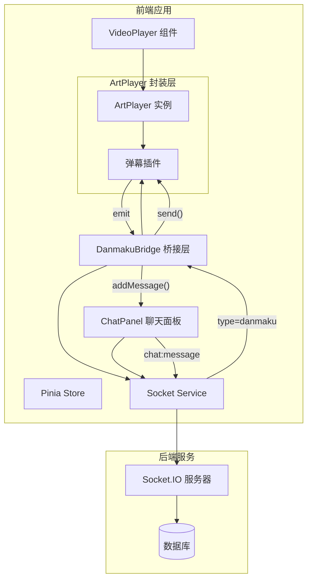

# WatchTogether - ArtPlayer 集成架构设计

## 1. 概述

本文档为 WatchTogether 平台集成 ArtPlayer 播放器并实现聊天-弹幕双向同步提供详细架构设计。

**目标**：
- 集成 ArtPlayer 替代原生 video 元素
- 实现弹幕功能（发送、显示、同步）
- 实现聊天-弹幕双向同步（聊天消息可转发为弹幕，弹幕可同时显示在聊天列表）
- 保持现有视频同步功能不受影响

## 2. 技术选型

### 2.1 选择 ArtPlayer

| 方案 | 维护状态 | 弹幕能力 | Vue3 兼容 | 评估 |
|------|----------|----------|-----------|------|
| **ArtPlayer** | 活跃 (2025) | 内置弹幕插件，API 成熟 | 良好 | ✅ **推荐** |
| DPlayer | 停止维护 (~2020) | 功能完整 | 一般 | ❌ 放弃 |
| xgplayer | 活跃 (字节) | 弹幕有 bug | 良好 | ⚠️ 次选 |

**选择理由**：
- GitHub 4.2K stars，持续维护
- `artplayer-plugin-danmuku` 弹幕插件成熟
- 支持动态发送弹幕：`art.plugins.artplayerPluginDanmuku.send()`
- 支持 Promise 异步加载弹幕数据
- 体积适中，功能完整

### 2.2 依赖

```json
{
  "dependencies": {
    "artplayer": "^5.2.0",
    "artplayer-plugin-danmuku": "^1.0.0"
  }
}
```

## 3. 当前架构分析

### 3.1 现有组件结构

```
frontend/src/
├── components/
│   ├── video/
│   │   ├── VideoPlayer.vue       # 视频播放器（原生 video）
│   │   └── VideoControls.vue     # 视频控制条
│   └── chat/
│       ├── ChatPanel.vue         # 聊天面板
│       ├── MessageInput.vue      # 消息输入
│       └── MessageList.vue       # 消息列表
├── services/
│   └── socket.js                 # Socket.IO 服务
└── stores/
    ├── room.js                   # 房间状态（含 videoState）
    └── chat.js                   # 聊天状态
```

### 3.2 现有 Socket 事件

| 事件 | 方向 | 用途 |
|------|------|------|
| `video:play` | 客户端 → 服务器 | 视频播放 |
| `video:pause` | 客户端 → 服务器 | 视频暂停 |
| `video:seek` | 客户端 → 服务器 | 视频跳转 |
| `video:sync-*` | 服务器 → 客户端 | 同步广播 |
| `chat:message` | 双向 | 聊天消息 |

### 3.3 现有 ChatMessageEvent 结构

```java
// 后端已存在的事件结构
public class ChatMessageEvent {
    private String roomId;
    private String content;
    private String type;        // "text", "image" - 可扩展为 "danmaku"
    private String senderId;
    private String senderNickname;
    private Long timestamp;
}
```

**关键发现**：后端 `type` 字段已存在，可直接复用，无需后端改动。

## 4. 系统架构设计

### 4.1 高层架构



### 4.2 核心设计原则

1. **事件复用**：复用现有 `chat:message` 事件，通过 `type` 字段区分消息类型
2. **单向数据流**：弹幕通过 Socket 广播，所有客户端同步显示
3. **关注点分离**：播放器逻辑、弹幕逻辑、聊天逻辑分离
4. **向后兼容**：不破坏现有视频同步和聊天功能

### 4.3 关键设计决策

**决策 1：复用 chat:message 事件而非新增事件**
- 理由：后端 ChatMessageEvent 已有 type 字段，可直接扩展
- 优势：后端零改动，降低联调成本
- 实现：`type: 'danmaku'` 标识弹幕消息

**决策 2：新增 DanmakuBridge 组件**
- 理由：解耦聊天和弹幕逻辑，避免 ChatPanel 和 ArtPlayer 直接耦合
- 职责：监听 Socket 消息，桥接聊天-弹幕双向同步
- 位置：RoomView.vue 中，作为独立组件

**决策 3：保留 VideoControls 组件**
- 理由：减少改动范围，降低风险
- 实现：ArtPlayer 隐藏默认控制条，使用现有 VideoControls

## 5. 组件设计

### 5.1 新组件结构

```
components/video/
├── VideoPlayer.vue          # 重构：内部使用 ArtPlayer
├── VideoControls.vue        # 保持不变
├── ArtPlayerWrapper.vue     # 新增：ArtPlayer 封装组件
└── DanmakuBridge.vue        # 新增：聊天-弹幕桥接组件
```

### 5.2 ArtPlayerWrapper.vue

职责：封装 ArtPlayer 实例，暴露统一 API。

```vue
<script setup>
import Artplayer from 'artplayer'
import artplayerPluginDanmuku from 'artplayer-plugin-danmuku'

const props = defineProps({
  videoUrl: { type: String, required: true },
  initialTime: { type: Number, default: 0 },
  isPlaying: { type: Boolean, default: false },
  danmakuEnabled: { type: Boolean, default: true }
})

const emit = defineEmits([
  'play', 'pause', 'seek', 'timeupdate',
  'ready', 'danmaku-send'
])

const containerRef = ref(null)
const art = ref(null)

function initPlayer() {
  art.value = new Artplayer({
    container: containerRef.value,
    url: props.videoUrl,
    type: 'mp4',
    autoplay: false,
    autoSize: false,
    autoMini: false,
    mutex: true,
    fastForward: true,
    lock: true,
    playbackRate: true,
    aspectRatio: true,
    setting: true,
    pip: false,
    fullscreen: true,
    fullscreenWeb: false,
    miniProgressBar: true,
    lang: 'zh-cn',
    // 隐藏默认控制条，使用外部 VideoControls
    controls: false,
    plugins: [
      artplayerPluginDanmuku({
        danmuku: [],
        speed: 5,
        margin: [10, '25%'],
        opacity: 1,
        fontSize: 25,
        color: '#FFFFFF',
        mode: 0,
        modes: [0, 1, 2],
        antiOverlap: true,
        useWorker: true,
        synchronousPlayback: false,
        filter: (danmu) => danmu.text.length > 0 && danmu.text.length <= 50
      })
    ]
  })

  // 绑定事件
  art.value.on('play', () => emit('play'))
  art.value.on('pause', () => emit('pause'))
  art.value.on('seek', (time) => emit('seek', time))
  art.value.on('video:timeupdate', () => emit('timeupdate', art.value.currentTime))
  art.value.on('ready', () => {
    if (props.initialTime > 0) {
      art.value.currentTime = props.initialTime
    }
    if (props.isPlaying) {
      art.value.play()
    }
    emit('ready')
  })
}

// 控制方法
function play() { art.value?.play() }
function pause() { art.value?.pause() }
function seek(time) { art.value && (art.value.currentTime = time) }

// 弹幕方法
function sendDanmaku(danmaku) {
  art.value?.plugins?.artplayerPluginDanmuku?.send({
    text: danmaku.text,
    mode: danmaku.mode || 0,
    color: danmaku.color || '#FFFFFF'
  })
}

defineExpose({ play, pause, seek, sendDanmaku, art })

onMounted(() => initPlayer())
onUnmounted(() => art.value?.destroy(false))
</script>

<template>
  <div ref="containerRef" class="artplayer-container"></div>
</template>
```

### 5.3 DanmakuBridge.vue

职责：桥接聊天-弹幕双向同步。

```vue
<script setup>
import { useChatStore } from '@/stores/chat'
import { useRoomStore } from '@/stores/room'
import socketService from '@/services/socket'

const props = defineProps({
  playerRef: { type: Object, required: true }
})

const chatStore = useChatStore()
const roomStore = useRoomStore()

// 接收弹幕：监听 chat:message，如果是 danmaku 类型则渲染弹幕
function setupListener() {
  socketService.onChatMessage((data) => {
    // 添加到聊天列表
    chatStore.addMessage(data)

    // 如果是弹幕类型，渲染到屏幕
    if (data.type === 'danmaku' && props.playerRef) {
      props.playerRef.sendDanmaku({
        text: data.content,
        mode: 0,
        color: '#FFFFFF'
      })
    }
  })
}

// 发送弹幕：同时发送到聊天和弹幕
function sendDanmaku(text, color = '#FFFFFF') {
  const data = {
    roomId: roomStore.currentRoom?.code,
    content: text,
    type: 'danmaku',
    color
  }

  // Socket 广播
  socketService.emitChatMessage(data)

  // 本地立即渲染弹幕（优化体验）
  props.playerRef?.sendDanmaku({ text, mode: 0, color })
}

defineExpose({ sendDanmaku })

onMounted(() => setupListener())
</script>

<template>
  <!-- 桥接层无 UI，纯逻辑组件 -->
</template>
```

### 5.4 VideoPlayer.vue 重构

```vue
<script setup>
import { ref, watch } from 'vue'
import ArtPlayerWrapper from './ArtPlayerWrapper.vue'
import VideoControls from './VideoControls.vue'
import socketService from '@/services/socket'
import { useRoomStore } from '@/stores/room'

const roomStore = useRoomStore()
const dplayerRef = ref(null)
const isSyncing = ref(false)

const videoState = computed(() => roomStore.videoState)

// Socket 同步事件监听（保持现有逻辑）
function setupSocketListeners() {
  socketService.onVideoSyncPlay((data) => {
    isSyncing.value = true
    dplayerRef.value?.play()
    setTimeout(() => isSyncing.value = false, 100)
  })

  socketService.onVideoSyncPause(() => {
    isSyncing.value = true
    dplayerRef.value?.pause()
    setTimeout(() => isSyncing.value = false, 100)
  })

  socketService.onVideoSyncSeek((data) => {
    isSyncing.value = true
    dplayerRef.value?.seek(data.time)
    setTimeout(() => isSyncing.value = false, 100)
  })
}

// 本地事件处理
function handlePlay() {
  if (!isSyncing.value) {
    socketService.emitVideoPlay(roomStore.currentRoom?.code, videoState.value.currentTime)
  }
}

function handlePause() {
  if (!isSyncing.value) {
    socketService.emitVideoPause(roomStore.currentRoom?.code)
  }
}

function handleSeek(time) {
  if (!isSyncing.value) {
    socketService.emitVideoSeek(roomStore.currentRoom?.code, time)
  }
}

// 暴露弹幕方法供外部调用
function sendDanmaku(danmaku) {
  dplayerRef.value?.sendDanmaku(danmaku)
}

defineExpose({ sendDanmaku })

onMounted(() => setupSocketListeners())
</script>

<template>
  <div class="video-player-wrapper">
    <div class="video-container">
      <ArtPlayerWrapper
        ref="dplayerRef"
        :video-url="videoState.url"
        :initial-time="videoState.currentTime"
        :is-playing="videoState.isPlaying"
        @play="handlePlay"
        @pause="handlePause"
        @seek="handleSeek"
      />
    </div>
    <VideoControls
      :current-time="videoState.currentTime"
      :duration="videoState.duration"
      :is-playing="videoState.isPlaying"
      :volume="1"
      @play="() => dplayerRef?.play()"
      @pause="() => dplayerRef?.pause()"
      @seek="(t) => dplayerRef?.seek(t)"
    />
  </div>
</template>
```

## 6. 数据流设计

### 6.1 聊天-弹幕双向同步流程

```
┌─────────────────────────────────────────────────────────┐
│                    用户发送弹幕                          │
└─────────────────────────────────────────────────────────┘
                          │
                          ▼
              ┌───────────────────────┐
              │ MessageInput 组件     │
              │ type: 'danmaku'       │
              └───────────────────────┘
                          │
                          ▼
              ┌───────────────────────┐
              │ socketService.emit    │
              │ chat:message          │
              └───────────────────────┘
                          │
                ┌────────┴────────┐
                ▼                 ▼
    ┌───────────────────┐  ┌───────────────────┐
    │ 服务器广播         │  │ 本地立即渲染       │
    │ chat:message      │  │                   │
    │ type: danmaku     │  │ 弹幕 + 聊天列表    │
    └───────────────────┘  └───────────────────┘
                │
                ▼
    ┌───────────────────┐
    │ 其他客户端接收     │
    │ DanmakuBridge     │
    │ → sendDanmaku()   │
    │ → addMessage()    │
    └───────────────────┘
```

### 6.2 消息数据结构

```typescript
interface ChatMessage {
  roomId: string;
  content: string;
  type: 'text' | 'image' | 'danmaku';  // 新增 danmaku 类型
  senderId: string;
  senderNickname: string;
  timestamp: number;
  color?: string;  // 弹幕颜色（仅 danmaku 类型）
}
```

### 6.3 Socket 事件扩展

现有事件无需新增，仅扩展 `chat:message` 的 `type` 枚举：

| type | 说明 | 行为 |
|------|------|------|
| `text` | 普通文字消息 | 仅显示在聊天列表 |
| `image` | 图片消息 | 仅显示在聊天列表 |
| `danmaku` | 弹幕消息 | **同时显示在聊天列表和弹幕** |

## 7. 集成策略

### 7.1 与现有系统的集成点

| 集成点 | 现有实现 | 新实现 | 兼容性处理 |
|--------|----------|--------|------------|
| 视频播放 | 原生 video | ArtPlayer | 事件适配层 |
| 视频同步 | Socket 事件 | 保持不变 | 无需修改 |
| 聊天系统 | chat:message | 扩展 type | 向后兼容 |
| 状态管理 | Pinia store | 无需修改 | 向后兼容 |

### 7.2 后端改动评估

**结论：后端零改动**

原因：
- `ChatMessageEvent` 已有 `type` 字段
- Socket.IO 广播逻辑不区分消息类型
- 新增 `danmaku` type 由前端自行处理

## 8. 迁移路径

### 8.1 分阶段实施

**阶段 1：ArtPlayer 基础集成（1天）**
- 安装依赖
- 创建 ArtPlayerWrapper.vue
- 重构 VideoPlayer.vue
- 验证基本播放和视频同步

**阶段 2：聊天-弹幕同步（1天）**
- 创建 DanmakuBridge.vue
- 修改 MessageInput.vue 支持弹幕模式
- 实现双向同步逻辑
- 测试多人同步场景

**阶段 3：优化与测试（0.5天）**
- 弹幕样式调整
- 性能优化
- 边界情况处理

### 8.2 回滚策略

- 保留 VideoPlayer.vue 的原生 video 实现（注释或分支）
- 使用环境变量控制：
  ```javascript
  const USE_ARTPLAYER = import.meta.env.VITE_USE_ARTPLAYER !== 'false'
  ```

## 9. 风险评估

| 风险 | 可能性 | 影响 | 缓解措施 |
|------|--------|------|----------|
| ArtPlayer 事件时序差异 | 中 | 中 | 预留适配层，调整 isSyncing 时间 |
| 弹幕密度过高影响性能 | 低 | 中 | 限制弹幕频率，开启 useWorker |
| 聊天消息量大导致弹幕过密 | 中 | 低 | 只转发 type=danmaku 的消息 |
| ArtPlayer 与 VideoControls 交互问题 | 低 | 中 | 通过 ref 直接调用播放器 API |

## 10. 总结

### 10.1 核心价值

1. **功能增强**：在同步观影基础上增加聊天-弹幕双向同步
2. **后端零改动**：复用现有 chat:message 事件，降低联调成本
3. **技术升级**：使用活跃维护的 ArtPlayer 替代原生实现

### 10.2 实施建议

1. 分阶段实施，每个阶段独立可验证
2. 优先保证视频同步功能不受影响
3. 聊天-弹幕同步作为增值功能，可降级处理

---

**文档版本**：1.0
**最后更新**：2026-03-19
**负责人**：架构团队
