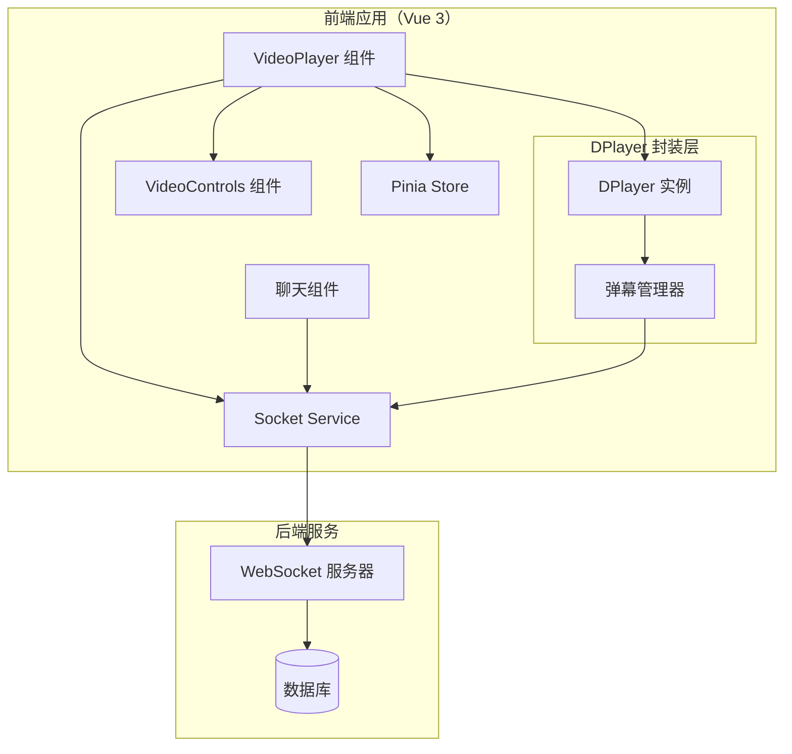

# WatchTogether 多人同步观影平台 - DPlayer 集成架构设计

## 1. 概述

本文档旨在为 WatchTogether 平台集成 DPlayer 弹幕播放器提供详细的架构设计方案。目标是在保持现有多人视频同步功能的基础上，增加完整的弹幕功能，提升用户体验。

**当前状态**：
- Vue 3 + Vite 前端应用
- 原生 `<video>` 元素实现视频播放
- Socket.IO 实现视频状态同步（播放/暂停/跳转/URL切换）
- Pinia 状态管理
- 已有聊天系统

**目标**：
- 集成 DPlayer 播放器，替代原生 video 元素
- 实现弹幕功能（发送、显示、同步）
- 保持现有的多人同步观影功能
- 提供可扩展的弹幕系统架构

## 2. 当前架构分析

### 2.1 现有组件结构

```
VideoPlayer.vue          # 视频播放器组件（使用原生 video 元素）
├── VideoControls.vue    # 视频控制组件
└── 通过 ref 暴露控制方法
```

### 2.2 状态管理

```javascript
// room store 中的 videoState
videoState: {
  url: '',
  isPlaying: false,
  currentTime: 0,
  duration: 0
}
```

### 2.3 同步机制

- **本地事件** → Socket 发射 → 服务器广播 → 其他客户端接收
- **同步事件** → 更新 video 元素状态（通过 `isSyncing` 标志防止循环）

### 2.4 现有架构的优势与局限

**优势**：
- 简单直接，易于理解
- 原生 video 元素兼容性好
- 同步机制已稳定工作

**局限**：
- 缺少高级播放器功能（如弹幕、画质切换、快捷键）
- 自定义控制 UI 开发成本高
- 弹幕功能需要从零开发

## 3. 技术选型

### 3.1 DPlayer 版本选择

**选择**: DPlayer v1.27.0+（最新稳定版）

**理由**：
- 功能完整：支持弹幕、字幕、画质切换、快捷键等
- 活跃维护：GitHub 项目活跃，文档齐全
- 体积适中：gzip 后约 30KB
- 兼容性好：支持 HLS、MP4、FLV 等多种格式
- 弹幕支持：内置弹幕引擎，性能优化良好

### 3.2 依赖管理

**新增依赖**：
```json
{
  "dependencies": {
    "dplayer": "^1.27.0",
    "hls.js": "^1.4.10"  // 可选，用于 HLS 流媒体支持
  }
}
```

**移除依赖**：
- `video.js`（当前未使用，可移除）

**版本兼容性**：
- DPlayer 为纯 JavaScript 库，与 Vue 3 无直接依赖冲突
- 建议锁定版本以确保稳定性

### 3.3 替代方案评估

| 方案 | 优点 | 缺点 | 评估 |
|------|------|------|------|
| **DPlayer** | 弹幕功能完善，社区活跃，文档齐全 | 需要额外集成工作 | ✅ **推荐** |
| video.js + 弹幕插件 | 功能强大，生态系统丰富 | 弹幕插件质量参差，集成复杂度高 | ⚠️ 次选 |
| 自研弹幕系统 | 完全可控，定制灵活 | 开发成本高，性能优化复杂 | ❌ 不推荐 |

## 4. 系统架构设计

### 4.1 高层架构图



### 4.2 架构原则

1. **向后兼容**：不破坏现有同步功能
2. **关注点分离**：播放器逻辑、弹幕逻辑、同步逻辑分离
3. **单向数据流**：状态变更通过 Store 管理
4. **事件驱动**：通过事件系统解耦组件
5. **性能优先**：弹幕渲染优化，避免内存泄漏

### 4.3 关键设计决策

**决策 1：封装 DPlayer 而非替换整个 VideoPlayer**
- 理由：现有 VideoPlayer 组件已包含 Socket 监听和状态管理逻辑
- 实现：在 VideoPlayer 内部将 `<video>` 替换为 DPlayer 实例

**决策 2：弹幕数据通过 Socket 同步**
- 理由：保持多人同步体验，所有用户看到相同的弹幕
- 实现：弹幕发送 → Socket 广播 → 所有客户端添加弹幕

**决策 3：保持现有控制组件接口**
- 理由：最小化改动，降低风险
- 实现：VideoControls 通过相同的事件与父组件通信

## 5. 组件设计

### 5.1 组件结构重构

```
components/video/
├── VideoPlayer.vue          # 重构：内部使用 DPlayer
├── VideoControls.vue        # 保持不变
├── DPlayerWrapper.vue       # 新增：DPlayer 封装组件
└── DanmakuController.vue    # 新增：弹幕控制组件（可选）
```

### 5.2 VideoPlayer.vue 重构方案

**方案一：渐进式重构（推荐）**

```vue
<!-- 新版 VideoPlayer.vue 结构 -->
<template>
  <div class="video-player-wrapper">
    <div class="video-container" ref="videoContainer">
      <!-- 使用 DPlayerWrapper 替代原生 video -->
      <DPlayerWrapper
        ref="dplayerRef"
        :video-url="videoUrl"
        :initial-time="currentTime"
        :is-playing="isPlaying"
        @play="handlePlay"
        @pause="handlePause"
        @seek="handleSeek"
        @timeupdate="handleTimeUpdate"
        @danmaku-send="handleDanmakuSend"
      />
    </div>
    
    <VideoControls ... />
  </div>
</template>
```

**方案二：直接集成 DPlayer**

```vue
<script setup>
// 在 setup 中直接实例化 DPlayer
import DPlayer from 'dplayer'

const dp = ref(null)

onMounted(() => {
  dp.value = new DPlayer({
    container: videoContainer.value,
    video: {
      url: videoUrl.value,
    },
    danmaku: {
      id: roomId,
      api: danmakuApiUrl,
    }
  })
  
  // 绑定事件
  dp.value.on('play', handlePlay)
  dp.value.on('pause', handlePause)
  // ...
})
</script>
```

**推荐方案一**：封装组件更好维护，逻辑更清晰。

### 5.3 DPlayerWrapper.vue 设计

```vue
<!-- DPlayerWrapper.vue -->
<script setup>
import { ref, onMounted, onUnmounted, watch } from 'vue'
import DPlayer from 'dplayer'
import 'dplayer/dist/DPlayer.min.css'

const props = defineProps({
  videoUrl: String,
  initialTime: Number,
  isPlaying: Boolean,
  danmakuList: Array,
  // ... 其他配置
})

const emit = defineEmits([
  'play', 'pause', 'seek', 'timeupdate',
  'loadedmetadata', 'ended', 'danmaku-send'
])

const containerRef = ref(null)
const dp = ref(null)

// 初始化 DPlayer
function initDPlayer() {
  dp.value = new DPlayer({
    container: containerRef.value,
    video: {
      url: props.videoUrl,
    },
    danmaku: {
      id: 'room-danmaku',
      api: '', // 使用本地弹幕数据
      addition: props.danmakuList || []
    },
    // 其他配置...
  })
  
  // 绑定事件
  dp.value.on('play', () => emit('play'))
  dp.value.on('pause', () => emit('pause'))
  dp.value.on('seek', () => {
    emit('seek', dp.value.video.currentTime)
  })
  dp.value.on('timeupdate', () => {
    emit('timeupdate', dp.value.video.currentTime)
  })
}

// 控制方法
function play() {
  dp.value?.play()
}

function pause() {
  dp.value?.pause()
}

function seek(time) {
  dp.value?.seek(time)
}

function addDanmaku(danmaku) {
  dp.value?.danmaku.draw(danmaku)
}

// 暴露方法给父组件
defineExpose({
  play,
  pause,
  seek,
  addDanmaku
})

onMounted(() => {
  initDPlayer()
})

onUnmounted(() => {
  dp.value?.destroy()
})
</script>
```

### 5.4 弹幕相关组件

**DanmakuController.vue**（可选）：
- 弹幕发送输入框
- 弹幕样式选择（颜色、位置）
- 弹幕显示/隐藏开关

**集成到现有聊天系统**：
- 方案A：扩展聊天输入框，增加"发送弹幕"模式
- 方案B：独立弹幕发送组件，放置在视频播放器下方

## 6. 数据流设计

### 6.1 视频状态数据流

```
用户操作
    ↓
DPlayer 事件（play/pause/seek）
    ↓
VideoPlayer 事件处理
    ↓
同步逻辑判断（isSyncing）
    ├─→ 本地同步：更新 Store
    └─→ 远程同步：Socket 发射
        ↓
    服务器广播
        ↓
    其他客户端接收
        ↓
    DPlayer 状态更新
```

### 6.2 弹幕数据流

```
用户发送弹幕
    ↓
DanmakuController 组件
    ↓
Socket 发射（danmaku:send）
    ↓
服务器处理 & 存储（可选）
    ↓
服务器广播（danmaku:receive）
    ↓
所有客户端接收
    ↓
DPlayerWrapper.addDanmaku()
    ↓
弹幕渲染显示
```

### 6.3 数据模型

**弹幕数据结构**：
```typescript
interface Danmaku {
  id: string;           // 唯一标识
  text: string;         // 弹幕内容
  time: number;         // 视频时间点（秒）
  color: string;        // 颜色（十六进制）
  type: 'top' | 'bottom' | 'scroll';  // 弹幕类型
  size: number;         // 字体大小
  userId?: string;      // 发送用户 ID
  timestamp: number;    // 发送时间戳
}
```

**视频状态扩展**：
```javascript
// 扩展 videoState
videoState: {
  // 现有字段
  url: '',
  isPlaying: false,
  currentTime: 0,
  duration: 0,
  
  // 新增弹幕相关
  danmakuEnabled: true,
  danmakuOpacity: 0.8,
  danmakuSpeed: 1.0
}
```

## 7. 弹幕系统设计

### 7.1 弹幕同步策略

**策略 1：完全同步（推荐）**
- 所有弹幕通过服务器转发
- 每个客户端在相同时间点显示相同弹幕
- 需要服务器存储弹幕历史

**策略 2：客户端主控**
- 弹幕发送到服务器，广播给其他客户端
- 客户端本地管理弹幕显示时间
- 减少服务器压力，但可能有同步偏差

**实现方案**：
```javascript
// Socket 事件定义
socketService.emitDanmakuSend(roomId, danmakuData)
socketService.onDanmakuReceive((danmaku) => {
  // 添加到 DPlayer
  dplayerRef.value?.addDanmaku(danmaku)
})
```

### 7.2 弹幕存储方案

**方案A：服务器端存储**
- 数据库存储房间弹幕历史
- 新用户加入时发送历史弹幕
- 支持弹幕回放

**方案B：客户端临时存储**
- 仅保存在线期间的弹幕
- 新用户加入时无历史弹幕
- 实现简单，服务器压力小

**推荐方案A**：提供更好的用户体验。

### 7.3 弹幕性能优化

1. **弹幕池管理**：
   - DPlayer 内置弹幕池，限制同时显示数量
   - 自动清理过期弹幕

2. **渲染优化**：
   - 使用 CSS3 硬件加速
   - 节流时间更新事件

3. **内存管理**：
   - 离开房间时清除弹幕数据
   - 避免内存泄漏

## 8. 集成策略

### 8.1 与现有系统的集成点

| 集成点 | 现有实现 | 新实现 | 兼容性处理 |
|--------|----------|--------|------------|
| 视频播放 | 原生 video 元素 | DPlayer 实例 | 事件桥接 |
| 状态同步 | Socket 事件监听 | 保持现有逻辑 | 增加弹幕事件 |
| 控制组件 | VideoControls 组件 | 保持接口不变 | 无需修改 |
| 状态管理 | Pinia store | 扩展 videoState | 向后兼容 |

### 8.2 事件映射表

| DPlayer 事件 | 现有事件处理 | 对应 Socket 事件 |
|--------------|--------------|------------------|
| play | handlePlay | video:play |
| pause | handlePause | video:pause |
| seeked | handleSeek | video:seek |
| timeupdate | handleTimeUpdate | - |
| danmakuSend | handleDanmakuSend | danmaku:send |

### 8.3 同步机制增强

**防止事件循环**：
```javascript
// 使用 isSyncing 标志（现有逻辑）
let isSyncing = false

// Socket 同步事件触发时
socketService.onVideoSyncPlay(() => {
  isSyncing = true
  dplayer.play()
  setTimeout(() => isSyncing = false, 100)
})

// 本地事件处理
function handlePlay() {
  if (!isSyncing) {
    socketService.emitVideoPlay(roomId, currentTime)
  }
}
```

## 9. 迁移路径

### 9.1 分阶段实施计划

**阶段 1：基础集成（1-2天）**
1. 安装 DPlayer 依赖
2. 创建 DPlayerWrapper 组件
3. 替换 VideoPlayer 中的 video 元素
4. 验证基本播放功能

**阶段 2：弹幕功能（2-3天）**
1. 实现弹幕发送与显示
2. 添加弹幕 Socket 事件
3. 创建弹幕控制 UI
4. 测试弹幕同步

**阶段 3：高级功能（1-2天）**
1. 弹幕设置（颜色、透明度、速度）
2. 弹幕历史存储
3. 性能优化
4. 完整测试

**阶段 4：优化与发布（1天）**
1. 性能测试与优化
2. 用户测试反馈
3. 文档更新
4. 正式发布

### 9.2 回滚策略

- 保留原有 VideoPlayer 实现，通过特性开关切换
- 使用环境变量控制播放器类型：
  ```javascript
  const USE_DPLAYER = import.meta.env.VITE_USE_DPLAYER === 'true'
  ```

### 9.3 测试策略

**单元测试**：
- DPlayerWrapper 组件测试
- 弹幕工具函数测试

**集成测试**：
- 视频同步功能测试
- 弹幕发送与接收测试

**E2E 测试**：
- 完整用户流程测试
- 多人同步场景测试

## 10. 风险评估与缓解措施

### 10.1 技术风险

| 风险 | 可能性 | 影响 | 缓解措施 |
|------|--------|------|----------|
| DPlayer 兼容性问题 | 中 | 中 | 1. 充分测试目标浏览器 2. 准备降级方案（回退原生 video） |
| 弹幕性能问题 | 高 | 高 | 1. 实施弹幕池限制 2. 性能监控与优化 3. 支持关闭弹幕选项 |
| 同步延迟增加 | 中 | 中 | 1. 优化事件处理逻辑 2. 减少不必要的事件触发 |
| 内存泄漏 | 中 | 高 | 1. 严格的生命周期管理 2. 内存使用监控 |

### 10.2 项目风险

| 风险 | 缓解措施 |
|------|----------|
| 开发时间超出预期 | 1. 分阶段实施 2. 优先核心功能 3. 每日进度跟踪 |
| 现有功能回归 | 1. 全面的测试覆盖 2. 特性开关控制 3. 渐进式迁移 |
| 用户体验不一致 | 1. UI/UX 设计评审 2. 用户测试反馈 3. A/B 测试 |

### 10.3 安全考虑

1. **弹幕内容安全**：
   - 后端内容过滤
   - 敏感词过滤系统
   - 用户举报机制

2. **DDoS 防护**：
   - 弹幕发送频率限制
   - 用户身份验证
   - 异常行为检测

## 11. 性能优化建议

### 11.1 弹幕渲染优化

1. **弹幕池大小限制**：同时显示不超过 100 条弹幕
2. **渲染节流**：避免每帧都更新弹幕位置
3. **离屏渲染**：对不可见弹幕暂停渲染

### 11.2 内存管理

1. **及时销毁**：离开房间时销毁 DPlayer 实例
2. **事件解绑**：组件卸载时移除所有事件监听
3. **数据清理**：定期清理历史弹幕数据

### 11.3 网络优化

1. **弹幕批量发送**：合并短时间内的弹幕发送
2. **数据压缩**：弹幕数据使用压缩格式
3. **CDN 加速**：视频资源使用 CDN

## 12. 扩展性考虑

### 12.1 弹幕功能扩展

1. **弹幕样式**：
   - 自定义字体、颜色、大小
   - 特殊效果（彩虹字、阴影、边框）
   - 图片弹幕（表情包）

2. **弹幕交互**：
   - 弹幕点赞、举报
   - 弹幕回复（二级弹幕）
   - 弹幕时间轴可视化

3. **弹幕管理**：
   - 用户屏蔽列表
   - 弹幕过滤规则
   - 管理员审核系统

### 12.2 播放器功能扩展

1. **多格式支持**：HLS、DASH、FLV
2. **画质切换**：多分辨率支持
3. **播放列表**：连续播放多个视频
4. **快捷键系统**：自定义快捷键

### 12.3 架构扩展

1. **微前端准备**：组件化设计便于未来拆分
2. **插件系统**：支持功能插件扩展
3. **配置化**：播放器配置可动态更新

## 13. 总结

### 13.1 核心价值

1. **功能增强**：在保持同步观影的基础上增加弹幕功能
2. **用户体验**：提供更丰富的互动方式，提升用户粘性
3. **技术升级**：用成熟播放器替代原生实现，降低维护成本

### 13.2 实施建议

1. **采用渐进式迁移**：分阶段实施，确保每一步都稳定可用
2. **保持向后兼容**：确保现有用户不受影响
3. **重视性能优化**：弹幕功能对性能影响较大，需持续优化
4. **完善监控体系**：实施前后性能监控，及时发现问题

### 13.3 后续规划

1. **短期（1个月）**：完成基础弹幕功能，用户测试
2. **中期（3个月）**：扩展弹幕样式，优化性能
3. **长期（6个月）**：构建完整弹幕生态系统

---

**文档版本**：1.0  
**最后更新**：2026-03-09  
**负责人**：架构师团队

