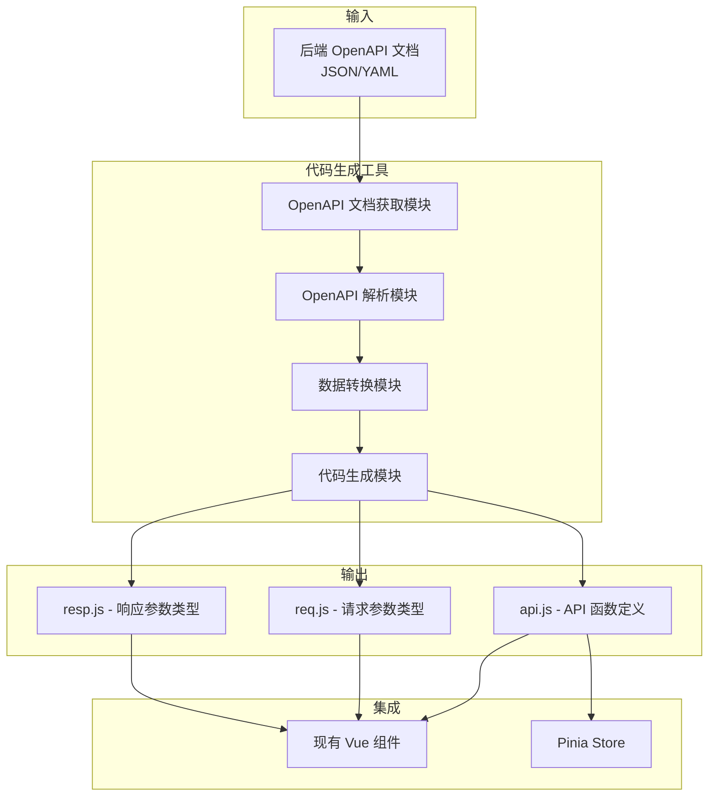

# 前端接口代码生成方案

## 概述

本项目旨在为 Vue.js + Vite 前端项目开发一个自动化接口代码生成工具，根据后端 Spring Boot 的 OpenAPI 文档自动生成前端 API 调用代码、请求参数类型定义和响应参数类型定义。通过此方案，可以实现前后端接口的同步更新，提高开发效率，减少手动编写 API 代码的错误。

## 整体架构



### 工作流程
1. **文档获取**: 从后端服务获取 OpenAPI 文档（JSON 格式）
2. **文档解析**: 解析 OpenAPI 文档，提取路径、操作、参数和模式定义
3. **数据转换**: 将解析后的数据结构转换为代码生成所需格式
4. **代码生成**: 使用模板引擎生成三个输出文件
5. **集成使用**: 现有前端代码导入生成的 API 模块

## 技术选型

### 1. OpenAPI 解析库
- **swagger-parser**: 用于解析和验证 OpenAPI 文档，支持 JSON/YAML 格式，提供完整的文档对象模型
- **选择理由**: 功能全面，支持 OpenAPI 3.x，提供异步解析和引用解析，社区活跃

### 2. 代码生成模板引擎
- **handlebars**: 轻量级逻辑-less 模板引擎，支持自定义 helper 函数
- **选择理由**: 语法简单，易于维护，支持条件判断和循环，适合代码生成场景

### 3. 类型定义生成
- **openapi-typescript**: 可选用于生成基础 TypeScript 类型定义
- **选择理由**: 专业生成 TypeScript 类型，但本项目需要自定义生成逻辑，因此作为参考而非直接使用

### 4. 工具运行环境
- **Node.js**: 作为脚本运行环境
- **选择理由**: 与前端构建工具链一致，便于集成到 npm scripts

### 5. 依赖安装
```bash
# 安装所需依赖
npm install --save-dev swagger-parser handlebars
```

## 组件/模块设计

### 1. OpenAPI 文档获取模块 (`fetchOpenAPI.js`)
- 功能: 从指定 URL 获取 OpenAPI JSON 文档
- 输入: OpenAPI 文档 URL（如 `http://localhost:18080/api-docs`）
- 输出: OpenAPI 文档对象
- 特性: 支持本地缓存，避免重复请求

### 2. OpenAPI 解析模块 (`parseOpenAPI.js`)
- 功能: 使用 swagger-parser 解析 OpenAPI 文档
- 输入: OpenAPI 文档对象
- 输出: 标准化接口数据结构
- 处理: 解析路径、操作、参数、请求体、响应模式

### 3. 数据转换模块 (`transformData.js`)
- 功能: 将解析后的数据转换为代码生成友好格式
- 输入: 解析后的 OpenAPI 数据
- 输出: 代码生成数据模型
- 处理: 
  - 接口分组（按标签或路径前缀）
  - 参数类型提取
  - 请求/响应模式提取
  - 生成函数命名

### 4. 代码生成模块 (`generateCode.js`)
- 功能: 使用模板生成三个输出文件
- 输入: 转换后的数据模型
- 输出: `api.js`, `req.js`, `resp.js` 文件内容
- 模板: 使用 Handlebars 模板定义代码结构

### 5. 主控模块 (`index.js`)
- 功能: 协调整个生成流程
- 输入: 配置文件（OpenAPI URL、输出路径等）
- 输出: 生成的文件
- 流程: 获取 → 解析 → 转换 → 生成 → 写入文件

## 数据结构设计

### OpenAPI 解析后的数据结构
```javascript
{
  // 基本信息
  info: {
    title: 'WatchTogether API',
    version: '1.0.0'
  },
  
  // 所有接口路径
  paths: [
    {
      path: '/rooms',
      methods: [
        {
          method: 'GET',
          operationId: 'listRooms',
          summary: '获取房间列表',
          tags: ['room'],
          parameters: [
            {
              name: 'page',
              in: 'query',
              required: false,
              schema: { type: 'integer', default: 1 }
            }
          ],
          requestBody: null,
          responses: {
            '200': {
              description: '成功',
              content: {
                'application/json': {
                  schema: { $ref: '#/components/schemas/RoomListResponse' }
                }
              }
            }
          }
        },
        {
          method: 'POST',
          operationId: 'createRoom',
          summary: '创建房间',
          tags: ['room'],
          parameters: [],
          requestBody: {
            content: {
              'application/json': {
                schema: { $ref: '#/components/schemas/CreateRoomRequest' }
              }
            }
          },
          responses: {
            '201': {
              description: '创建成功',
              content: {
                'application/json': {
                  schema: { $ref: '#/components/schemas/Room' }
                }
              }
            }
          }
        }
      ]
    }
  ],
  
  // 组件模式定义
  components: {
    schemas: {
      'CreateRoomRequest': {
        type: 'object',
        properties: {
          name: { type: 'string' },
          maxUsers: { type: 'integer', minimum: 1, maximum: 50 }
        },
        required: ['name']
      },
      'Room': {
        type: 'object',
        properties: {
          id: { type: 'string' },
          name: { type: 'string' },
          maxUsers: { type: 'integer' }
        }
      }
    }
  }
}
```

### 代码生成数据模型
```javascript
{
  // API 函数分组
  apiGroups: [
    {
      groupName: 'roomApi',
      functions: [
        {
          functionName: 'create',
          operationId: 'createRoom',
          path: '/rooms',
          method: 'POST',
          parameters: [
            { name: 'data', type: 'CreateRoomRequest', isBody: true }
          ],
          responseType: 'Room',
          summary: '创建房间'
        },
        {
          functionName: 'list',
          operationId: 'listRooms',
          path: '/rooms',
          method: 'GET',
          parameters: [
            { name: 'page', type: 'number', isQuery: true, defaultValue: 1 }
          ],
          responseType: 'RoomListResponse',
          summary: '获取房间列表'
        }
      ]
    }
  ],
  
  // 请求类型定义
  requestTypes: [
    {
      typeName: 'CreateRoomRequest',
      properties: [
        { name: 'name', type: 'string', required: true },
        { name: 'maxUsers', type: 'number', required: false }
      ]
    }
  ],
  
  // 响应类型定义
  responseTypes: [
    {
      typeName: 'Room',
      properties: [
        { name: 'id', type: 'string' },
        { name: 'name', type: 'string' },
        { name: 'maxUsers', type: 'number' }
      ]
    }
  ]
}
```

## 生成文件格式示例

### 1. `api.js` - API 函数定义
```javascript
// frontend/src/services/generated/api.js
// 自动生成于: 2025-03-17 14:30:00
// 来源: http://localhost:18080/api-docs

const API_BASE = import.meta.env.VITE_API_BASE_URL || '/api'

async function request(path, options = {}) {
  const response = await fetch(`${API_BASE}${path}`, {
    headers: {
      'Content-Type': 'application/json',
      ...options.headers
    },
    ...options
  })
  
  if (!response.ok) {
    const error = await response.json().catch(() => ({}))
    throw new Error(error.message || '请求失败')
  }
  
  return response.json()
}

// 房间 API
export const roomApi = {
  /**
   * 创建房间
   * @param {CreateRoomRequest} data - 房间创建数据
   * @returns {Promise<Room>} 创建的房间信息
   */
  create(data) {
    return request('/rooms', {
      method: 'POST',
      body: JSON.stringify(data)
    })
  },
  
  /**
   * 获取房间列表
   * @param {number} [page=1] - 页码
   * @param {number} [size=20] - 每页数量
   * @returns {Promise<RoomListResponse>} 房间列表
   */
  list(page = 1, size = 20) {
    const params = new URLSearchParams()
    if (page !== undefined) params.append('page', page)
    if (size !== undefined) params.append('size', size)
    
    return request(`/rooms?${params.toString()}`)
  },
  
  /**
   * 获取房间详情
   * @param {string} roomId - 房间ID
   * @returns {Promise<Room>} 房间详情
   */
  get(roomId) {
    return request(`/rooms/${roomId}`)
  },
  
  /**
   * 删除房间
   * @param {string} roomId - 房间ID
   * @returns {Promise<void>}
   */
  delete(roomId) {
    return request(`/rooms/${roomId}`, { method: 'DELETE' })
  }
}

// 会话 API
export const sessionApi = {
  /**
   * 创建会话
   * @param {CreateSessionRequest} data - 会话创建数据
   * @returns {Promise<Session>} 创建的会话信息
   */
  create(data) {
    return request('/sessions', {
      method: 'POST',
      body: JSON.stringify(data)
    })
  },
  
  /**
   * 获取会话详情
   * @param {string} sessionId - 会话ID
   * @returns {Promise<Session>} 会话详情
   */
  get(sessionId) {
    return request(`/sessions/${sessionId}`)
  }
}

// 表情 API
export const emojiApi = {
  /**
   * 获取表情分类
   * @returns {Promise<EmojiCategory[]>} 表情分类列表
   */
  getCategories() {
    return request('/emojis/categories')
  },
  
  /**
   * 获取表情列表
   * @param {string} [categoryId] - 分类ID（可选）
   * @returns {Promise<Emoji[]>} 表情列表
   */
  list(categoryId) {
    const query = categoryId ? `?category_id=${encodeURIComponent(categoryId)}` : ''
    return request(`/emojis${query}`)
  }
}

// 视频 API
export const videoApi = {
  /**
   * 获取示例视频列表
   * @returns {Promise<VideoSample[]>} 示例视频列表
   */
  getSamples() {
    return request('/videos/samples')
  },
  
  /**
   * 上传视频
   * @param {File} file - 视频文件
   * @returns {Promise<UploadVideoResponse>} 上传结果
   */
  upload(file) {
    const formData = new FormData()
    formData.append('file', file)
    
    return fetch(`${API_BASE}/videos/upload`, {
      method: 'POST',
      body: formData
    }).then(r => r.json())
  }
}
```

### 2. `req.js` - 请求参数类型定义
```javascript
// frontend/src/services/generated/req.js
// 自动生成于: 2025-03-17 14:30:00
// 来源: http://localhost:18080/api-docs

/**
 * @typedef {Object} CreateRoomRequest
 * @property {string} name - 房间名称
 * @property {number} [maxUsers] - 最大用户数，默认为5
 * @property {boolean} [isPublic] - 是否公开，默认为true
 * @property {string} [creatorSessionId] - 创建者会话ID
 * @property {string} [creatorNickname] - 创建者昵称
 */

/**
 * @typedef {Object} UpdateRoomRequest
 * @property {string} [name] - 房间名称
 * @property {number} [maxUsers] - 最大用户数
 * @property {boolean} [isPublic] - 是否公开
 */

/**
 * @typedef {Object} CreateSessionRequest
 * @property {string} nickname - 用户昵称
 * @property {string} [avatar] - 用户头像
 */

/**
 * @typedef {Object} UpdateSessionRequest
 * @property {string} [nickname] - 用户昵称
 * @property {string} [avatar] - 用户头像
 */

/**
 * @typedef {Object} UploadEmojiRequest
 * @property {File} file - 表情文件
 * @property {string} displayName - 显示名称
 */

/**
 * @typedef {Object} AddFavoriteRequest
 * @property {string} emojiId - 表情ID
 */

/**
 * @typedef {Object} UploadVideoRequest
 * @property {File} file - 视频文件
 */

// 导出所有类型以便于 IDE 支持
export {}
```

### 3. `resp.js` - 响应参数类型定义
```javascript
// frontend/src/services/generated/resp.js
// 自动生成于: 2025-03-17 14:30:00
// 来源: http://localhost:18080/api-docs

/**
 * @typedef {Object} Room
 * @property {string} id - 房间ID
 * @property {string} name - 房间名称
 * @property {number} maxUsers - 最大用户数
 * @property {boolean} isPublic - 是否公开
 * @property {string} creatorSessionId - 创建者会话ID
 * @property {string} creatorNickname - 创建者昵称
 * @property {number} userCount - 当前用户数
 * @property {string} createdAt - 创建时间
 * @property {string} [inviteCode] - 邀请码
 * @property {string} [videoUrl] - 视频URL
 * @property {number} [currentTime] - 当前播放时间
 * @property {boolean} [isPlaying] - 是否正在播放
 */

/**
 * @typedef {Object} RoomListResponse
 * @property {Room[]} items - 房间列表
 * @property {number} page - 当前页码
 * @property {number} size - 每页数量
 * @property {number} total - 总数量
 */

/**
 * @typedef {Object} Session
 * @property {string} id - 会话ID
 * @property {string} nickname - 用户昵称
 * @property {string} avatar - 用户头像
 * @property {string} createdAt - 创建时间
 */

/**
 * @typedef {Object} SessionHistoryResponse
 * @property {RoomHistory[]} rooms - 历史房间记录
 * @property {number} total - 总数量
 */

/**
 * @typedef {Object} RoomHistory
 * @property {string} roomId - 房间ID
 * @property {string} roomName - 房间名称
 * @property {number} userCount - 用户数量
 * @property {string} joinedAt - 加入时间
 * @property {string} lastActivity - 最后活动时间
 */

/**
 * @typedef {Object} EmojiCategory
 * @property {string} id - 分类ID
 * @property {string} name - 分类名称
 * @property {number} count - 表情数量
 */

/**
 * @typedef {Object} Emoji
 * @property {string} id - 表情ID
 * @property {string} code - 表情代码
 * @property {string} name - 表情名称
 * @property {string} categoryId - 分类ID
 */

/**
 * @typedef {Object} FavoriteEmoji
 * @property {string} id - 收藏ID
 * @property {string} emojiId - 表情ID
 * @property {string} emojiCode - 表情代码
 * @property {string} addedAt - 添加时间
 */

/**
 * @typedef {Object} VideoSample
 * @property {string} id - 视频ID
 * @property {string} name - 视频名称
 * @property {string} url - 视频URL
 * @property {number} duration - 视频时长（秒）
 * @property {string} thumbnail - 缩略图URL
 */

/**
 * @typedef {Object} UploadVideoResponse
 * @property {string} videoId - 视频ID
 * @property {string} url - 视频URL
 * @property {number} size - 文件大小
 * @property {string} uploadedAt - 上传时间
 */

// 导出所有类型以便于 IDE 支持
export {}
```

## 集成到现有项目的方案

### 1. 文件结构调整
```
frontend/src/services/
├── api.js                    # 现有 API 文件（将被替换或迁移）
├── socket.js                 # 现有 WebSocket 文件
└── generated/               # 新增：生成的代码目录
    ├── api.js               # 生成的 API 函数
    ├── req.js               # 生成的请求类型
    ├── resp.js              # 生成的响应类型
    └── index.js             # 统一导出文件
```

### 2. 迁移策略
#### 方案 A：直接替换（推荐）
1. 备份现有 `api.js` 文件
2. 运行生成工具，输出到 `frontend/src/services/generated/`
3. 修改 `frontend/src/services/api.js` 重新导出生成的 API：
```javascript
// frontend/src/services/api.js
export * from './generated/api.js'
export * from './generated/req.js'
export * from './generated/resp.js'
```

#### 方案 B：渐进式迁移
1. 生成新 API 到 `generated/` 目录
2. 逐步修改现有组件导入路径：
```javascript
// 从
import { roomApi } from '@/services/api.js'
// 改为
import { roomApi } from '@/services/generated/api.js'
```
3. 最终移除旧 `api.js` 文件

### 3. 现有组件适配
现有组件无需大量修改，只需确保导入路径正确。生成的 API 函数保持与现有 API 相似的签名，减少迁移成本。

### 4. 类型提示支持
虽然项目使用 JavaScript，但通过 JSDoc 注释，现代 IDE（如 VS Code）仍能提供类型提示：
```javascript
// 在 Vue 组件中使用
import { roomApi } from '@/services/api.js'

export default {
  methods: {
    async createRoom() {
      // IDE 会提示参数类型和返回值类型
      const room = await roomApi.create({
        name: '电影夜',
        maxUsers: 10
      })
      console.log(room.id) // 正确提示 room 的属性
    }
  }
}
```

## 开发工作流设计

### 1. 生成工具配置
创建配置文件 `openapi.config.js`：
```javascript
// frontend/openapi.config.js
export default {
  // OpenAPI 文档 URL
  openapiUrl: process.env.VITE_OPENAPI_URL || 'http://localhost:18080/api-docs',
  
  // 输出目录
  outputDir: './src/services/generated',
  
  // 文件输出配置
  files: {
    api: 'api.js',
    request: 'req.js', 
    response: 'resp.js'
  },
  
  // API 分组配置
  groups: [
    { name: 'roomApi', tag: 'room', pathPrefix: '/rooms' },
    { name: 'sessionApi', tag: 'session', pathPrefix: '/sessions' },
    { name: 'emojiApi', tag: 'emoji', pathPrefix: '/emojis' },
    { name: 'videoApi', tag: 'video', pathPrefix: '/videos' }
  ],
  
  // 请求函数配置
  requestConfig: {
    baseUrl: 'import.meta.env.VITE_API_BASE_URL || \'/api\'',
    includeMock: false // 是否包含 mock 功能
  },

  // Watch 模式配置
  watchMode: process.env.NODE_ENV !== 'production' // 生产环境默认不开启
}
```

### 2. 生成命令
在 `package.json` 中添加 scripts：
```json
{
  "scripts": {
    "generate:api": "node scripts/generate-api.js",
    "generate:api:watch": "node scripts/generate-api.js --watch",
    "dev:with-api": "npm run generate:api && vite",
    "build:with-api": "npm run generate:api && vite build"
  }
}
```

### 3. 自动更新策略
#### 开发环境
1. **热重载模式**: 使用 `--watch` 参数监控 OpenAPI 文档变化
2. **预启动生成**: 在 `dev` 脚本前自动生成
3. **手动触发**: 开发人员可随时运行 `npm run generate:api`

#### 生产环境
1. **构建时生成**: 在 `build` 脚本中集成生成步骤
2. **版本控制**: 生成的代码纳入版本控制，确保一致性

### 4. CI/CD 集成
在 CI 流水线中添加生成验证步骤：
```yaml
steps:
  - name: Generate API
    run: npm run generate:api
    
  - name: Check for changes
    run: |
      if git diff --name-only | grep -q "src/services/generated"; then
        echo "API 代码需要更新，请重新生成并提交"
        exit 1
      fi
```

## 后续扩展性考虑

### 1. 自定义模板支持
允许开发者自定义生成模板：
```
frontend/openapi-templates/
├── api.hbs          # API 函数模板
├── request.hbs      # 请求类型模板  
├── response.hbs     # 响应类型模板
└── helpers.js       # 自定义 helper 函数
```

### 2. 插件系统
支持插件扩展功能：
- **认证插件**: 自动添加认证头
- **缓存插件**: 添加请求缓存逻辑
- **Mock 插件**: 集成 mock 数据生成
- **验证插件**: 添加参数验证逻辑

### 3. 多格式支持
扩展支持其他生成格式：
- TypeScript 定义文件（.d.ts）
- Vue Composition API hooks
- Pinia store 模块
- React hooks

### 4. 配置预设
提供常用框架的预设配置：
- Vue 2 + Axios
- Vue 3 + Composition API
- React + SWR
- Svelte

### 5. 文档生成
扩展生成 API 使用文档：
- Markdown 格式的 API 文档
- 交互式 API 示例
- TypeScript 类型文档

### 6. 验证与测试
- 生成的代码自动通过 ESLint 检查
- 生成单元测试模板
- 接口兼容性验证

## 实施计划

### 第一阶段：基础生成功能（1-2天）
1. 实现 OpenAPI 文档获取和解析
2. 实现基础代码生成（api.js）
3. 添加配置文件支持
4. 集成到现有项目

### 第二阶段：类型定义生成（1天）
1. 实现请求/响应类型生成（req.js, resp.js）
2. 优化 JSDoc 注释格式
3. 添加类型引用解析

### 第三阶段：增强功能（2-3天）
1. 添加自定义模板支持
2. 实现 watch 模式
3. 添加错误处理和日志
4. 编写使用文档

### 第四阶段：扩展与优化（后续迭代）
1. 插件系统设计
2. 多格式输出支持
3. CI/CD 集成优化
4. 性能优化

## 风险与缓解

### 风险 1：OpenAPI 文档不规范
- **缓解**: 使用 swagger-parser 进行验证，提供错误提示和修复建议

### 风险 2：生成的代码与现有代码不兼容
- **缓解**: 提供渐进式迁移方案，保持 API 函数签名一致

### 风险 3：生成工具性能问题
- **缓解**: 实现缓存机制，增量生成，优化模板渲染

### 风险 4：团队接受度
- **缓解**: 提供详细文档和示例，展示类型提示优势，逐步推广

## 总结

本方案设计了一个灵活、可扩展的前端接口代码生成工具，能够根据后端 OpenAPI 文档自动生成类型安全的 API 代码。通过模块化设计和模板引擎，工具易于定制和维护。集成到现有项目后，可以显著提高开发效率，减少接口调用错误，提升代码质量。

工具的核心价值在于：
1. **自动化**: 减少手动编写 API 代码的工作量
2. **类型安全**: 通过 JSDoc 提供类型提示，提前发现潜在错误
3. **一致性**: 确保前后端接口定义同步
4. **可维护性**: 集中管理接口定义，便于更新和维护

建议从基础功能开始实施，逐步迭代增强，最终形成一个完整的 API 代码生成解决方案。

## 附录：基础生成脚本示例

### 1. 项目结构
```
scripts/
├── generate-api.js          # 主入口文件
├── lib/
│   ├── fetch-openapi.js    # OpenAPI 获取模块
│   ├── parse-openapi.js    # OpenAPI 解析模块
│   ├── transform-data.js   # 数据转换模块
│   ├── generate-code.js    # 代码生成模块
│   └── templates/          # Handlebars 模板
│       ├── api.hbs
│       ├── request.hbs
│       └── response.hbs
└── utils/
    └── logger.js
```

### 2. 主入口文件示例 (`scripts/generate-api.js`)
```javascript
#!/usr/bin/env node

import fs from 'fs'
import path from 'path'
import { fileURLToPath } from 'url'
import config from '../openapi.config.js'
import { fetchOpenAPI } from './lib/fetch-openapi.js'
import { parseOpenAPI } from './lib/parse-openapi.js'
import { transformData } from './lib/transform-data.js'
import { generateCode } from './lib/generate-code.js'

const __dirname = path.dirname(fileURLToPath(import.meta.url))

async function main() {
  try {
    console.log('🚀 开始生成 API 代码...')
    
    // 1. 获取 OpenAPI 文档
    console.log(`📡 获取 OpenAPI 文档: ${config.openapiUrl}`)
    const openapiDoc = await fetchOpenAPI(config.openapiUrl)
    
    // 2. 解析 OpenAPI 文档
    console.log('🔍 解析 OpenAPI 文档...')
    const parsedData = await parseOpenAPI(openapiDoc)
    
    // 3. 转换数据
    console.log('🔄 转换数据格式...')
    const transformedData = transformData(parsedData, config)
    
    // 4. 生成代码
    console.log('💻 生成代码文件...')
    const generated = generateCode(transformedData, config)
    
    // 5. 写入文件
    const outputDir = path.resolve(__dirname, '..', config.outputDir)
    if (!fs.existsSync(outputDir)) {
      fs.mkdirSync(outputDir, { recursive: true })
    }
    
    Object.entries(generated).forEach(([filename, content]) => {
      const filepath = path.join(outputDir, filename)
      fs.writeFileSync(filepath, content)
      console.log(`✅ 生成文件: ${filename}`)
    })
    
    console.log('🎉 API 代码生成完成！')
  } catch (error) {
    console.error('❌ 生成失败:', error.message)
    process.exit(1)
  }
}

// 支持命令行参数
const args = process.argv.slice(2)
if (args.includes('--watch')) {
  // 检查配置是否允许 watch 模式
  if (config.watchMode !== false) {
    console.log('👀 进入监控模式...')
    // 实现监控逻辑
  } else {
    console.warn('⚠️ Watch 模式在生产环境中已禁用，使用普通生成模式')
    main()
  }
} else {
  main()
}
```

### 3. OpenAPI 获取模块示例 (`scripts/lib/fetch-openapi.js`)
```javascript
import fetch from 'node-fetch'

export async function fetchOpenAPI(url) {
  const response = await fetch(url)
  if (!response.ok) {
    throw new Error(`获取 OpenAPI 文档失败: ${response.statusText}`)
  }
  return response.json()
}
```

### 4. 简单模板示例 (`scripts/lib/templates/api.hbs`)
```handlebars
// {{filename}}
// 自动生成于: {{timestamp}}
// 来源: {{sourceUrl}}

const API_BASE = {{baseUrl}}

async function request(path, options = {}) {
  const response = await fetch(`${API_BASE}${path}`, {
    headers: {
      'Content-Type': 'application/json',
      ...options.headers
    },
    ...options
  })
  
  if (!response.ok) {
    const error = await response.json().catch(() => ({}))
    throw new Error(error.message || '请求失败')
  }
  
  return response.json()
}

{{#each apiGroups}}
// {{groupName}} API
export const {{groupName}} = {
  {{#each functions}}
  /**
   * {{summary}}
   {{#each parameters}}
   * @param {{{type}}} {{name}} - {{description}}
   {{/each}}
   * @returns {Promise<{{responseType}}>}
   */
  {{functionName}}({{#each parameters}}{{name}}{{#unless @last}}, {{/unless}}{{/each}}) {
    {{#if parameters}}
    // 构建请求参数
    {{#if hasBody}}
    return request('{{path}}', {
      method: '{{method}}',
      body: JSON.stringify({{bodyParam.name}})
    })
    {{else}}
    const params = new URLSearchParams()
    {{#each parameters}}
    {{#if isQuery}}
    if ({{name}} !== undefined) params.append('{{queryName}}', {{name}})
    {{/if}}
    {{/each}}
    return request(`{{path}}?${params.toString()}`)
    {{/if}}
    {{else}}
    return request('{{path}}')
    {{/if}}
  }{{#unless @last}},{{/unless}}
  {{/each}}
}
{{/each}}
```

### 5. 安装和使用
```bash
# 安装依赖
npm install --save-dev node-fetch swagger-parser handlebars

# 添加生成脚本到 package.json
# 运行生成
npm run generate:api
```

此基础示例展示了生成工具的核心结构，实际实现需要根据具体需求进行扩展和优化。
