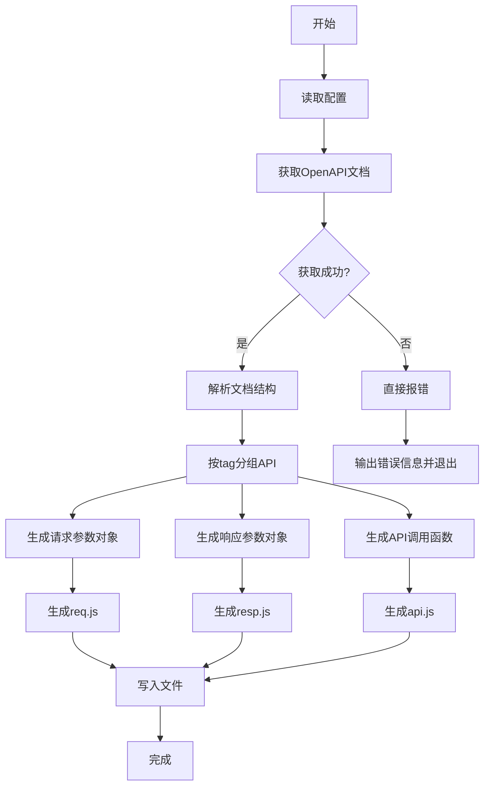

# 自动化接口代码生成工具架构方案

## 项目概述

本工具旨在根据后端Spring Boot的OpenAPI文档自动生成前端API调用代码，提升开发效率，确保前后端接口一致性。

## 工具目标

- 从 `http://localhost:18080/api-docs` 获取OpenAPI JSON文档
- 解析文档结构，提取接口定义
- 生成符合ES6/ESModule标准的三个核心文件：
  - `api.js` - API调用函数
  - `req.js` - 请求参数对象
  - `resp.js` - 响应参数对象
- 代码风格一致，可读性好

## 目录结构

### 工具本身目录结构
```
frontend/scripts/
├── openapi-generator/          # 工具主目录
│   ├── index.js               # 主入口脚本
│   ├── config.js              # 配置管理
│   ├── openapi-client.js      # OpenAPI文档获取与解析
│   ├── code-generator.js      # 代码生成逻辑
│   ├── templates/             # 代码模板
│   │   ├── api.js.template
│   │   ├── req.js.template
│   │   └── resp.js.template
│   └── utils/
│       ├── file-utils.js      # 文件操作工具
│       └── validation.js      # 数据验证工具
└── generate-api.js            # 快捷入口（调用主工具）
```

### 生成文件目录结构
```
frontend/src/
├── services/
│   ├── api.js                 # 生成的API调用函数（自动生成）
│   ├── req.js                 # 生成的请求参数对象（自动生成）
│   └── resp.js                # 生成的响应参数对象（自动生成）
└── utils/
    └── request.js             # 通用请求方法（独立文件，首次运行时初始化）
```

**文件生成策略**：
- `api.js`、`req.js`、`resp.js`：每次运行工具时覆盖生成
- `request.js`：首次运行时创建，已存在则跳过（避免覆盖用户自定义修改）

## 核心模块设计

### 1. 配置管理模块 (config.js)
负责读取和管理工具配置，支持命令行参数、环境变量和配置文件。

**配置选项：**
- `openapiUrl`: OpenAPI文档URL（默认：http://localhost:18080/api-docs）
- `outputDir`: 输出目录（默认：./frontend/src/services）
- `utilsDir`: 工具类目录（默认：./frontend/src/utils）
- `apiFileName`: API文件名（默认：api.js）
- `reqFileName`: 请求参数文件名（默认：req.js）
- `respFileName`: 响应参数文件名（默认：resp.js）
- `requestFileName`: request方法文件名（默认：request.js）
- `basePath`: API基础路径（从OpenAPI文档自动提取）
- `tags`: 指定要生成的tag（默认：全部）
- `filterUnknownParams`: 是否过滤未定义参数（默认：false）
- `strictMode`: 严格模式：拒绝未定义参数（默认：false）
- `initRequestFile`: 是否初始化request.js文件（默认：true）

### 2. OpenAPI客户端模块 (openapi-client.js)
负责获取和解析OpenAPI文档，**文档仅保存在内存中，不持久化到文件**。

**主要功能：**
- 发送HTTP请求获取OpenAPI JSON文档
- 验证文档格式和版本
- 解析文档结构，提取关键信息：
  - 服务器信息（base URL）
  - 路径（paths）
  - 操作（operations）
  - 参数（parameters）
  - 响应模式（response schemas）
  - 组件定义（components/schemas）
- 数据结构化，便于代码生成
- 文档仅保存在内存中，每次运行工具时重新获取

### 3. 代码生成器模块 (code-generator.js)
核心代码生成逻辑，将OpenAPI定义转换为前端代码。

**子模块：**
- **API函数生成器**：根据路径和操作生成API调用函数，传递参数定义支持严格模式
- **参数对象生成器**：生成请求参数对象定义（JSDoc注释）
- **响应对象生成器**：生成响应参数对象定义（JSDoc注释）

**注意**：通用request方法作为独立文件 `frontend/src/utils/request.js` 存在，不参与代码生成，api.js 中直接引用。

### 4. 模板引擎模块
使用模板文件生成代码，提高可维护性和可扩展性。

**模板变量：**
- `{{apiGroups}}` - 按tag分组的API接口
- `{{requestObjects}}` - 请求参数对象定义
- `{{responseObjects}}` - 响应参数对象定义
- `{{imports}}` - 导入语句（包含 request.js 的引用）
- `{{exports}}` - 导出语句

## 数据处理流程



## 代码生成算法

### 1. API分组策略
- 使用OpenAPI的`tags`字段对接口进行分组
- 每个tag对应一个API对象，命名规则：`TagNameApi`（首字母大写，去掉特殊字符）
- 没有tag的接口归到`DefaultApi`

### 2. 接口方法命名规则
- 基于操作ID（operationId）或路径生成方法名
- 命名规则：`动词 + 路径名词`，例如：`getSessions`、`createSession`
- 默认使用小驼峰命名法
- 生成的文件均为JavaScript文件（.js）

### 3. 通用request方法设计（独立文件）

request方法将作为独立文件 `frontend/src/utils/request.js` 存在，api.js 中直接引用。

**request.js 文件内容**：
```javascript
/**
 * 通用API请求方法
 * @param {string} path - 请求路径
 * @param {Object} options - 请求选项
 * @param {string} options.method - HTTP方法
 * @param {Object} options.params - 查询参数
 * @param {Object} options.data - 请求体数据
 * @param {Object} options.headers - 请求头
 * @param {string[]} options.allowedParams - 允许的参数列表（可选）
 * @param {boolean} options.strictMode - 严格模式（可选）
 * @param {Object} options.paramDefinitions - 参数定义（从OpenAPI生成）
 * @param {Function} options.requestInterceptor - 请求拦截器（可选）
 * @param {Function} options.responseInterceptor - 响应拦截器（可选）
 * @returns {Promise} Promise对象
 */
export async function request(path, options = {}) {
  const { 
    method = 'GET', 
    params, 
    data, 
    headers = {},
    allowedParams,
    strictMode = false,
    paramDefinitions = {},
    requestInterceptor,
    responseInterceptor
  } = options;
  
  // 构建完整URL
  const baseUrl = import.meta.env.VITE_API_BASE_URL || '';
  const url = new URL(`${baseUrl}${path}`);
  
  // 处理查询参数
  if (params) {
    // 确定允许的参数列表
    let allowedKeys = null;
    
    if (allowedParams && Array.isArray(allowedParams)) {
      // 1. 如果指定了 allowedParams，使用它
      allowedKeys = allowedParams;
    } else if (strictMode && paramDefinitions && Object.keys(paramDefinitions).length > 0) {
      // 2. strictMode=true 且未指定 allowedParams，使用 OpenAPI 参数定义
      allowedKeys = Object.keys(paramDefinitions);
    }
    
    if (allowedKeys) {
      // 有过滤逻辑
      Object.keys(params).forEach(key => {
        if (allowedKeys.includes(key)) {
          if (params[key] !== undefined && params[key] !== null) {
            url.searchParams.append(key, params[key]);
          }
        } else if (strictMode) {
          // 严格模式：遇到未定义参数抛出错误
          throw new Error(`参数验证失败：未定义的参数 "${key}"`);
        }
        // 非严格模式：忽略未定义参数
      });
    } else {
      // 默认行为：不过滤参数
      Object.keys(params).forEach(key => {
        if (params[key] !== undefined && params[key] !== null) {
          url.searchParams.append(key, params[key]);
        }
      });
    }
  }
  
  // 设置请求头
  const defaultHeaders = {
    'Content-Type': 'application/json',
    // 可以添加认证头等
  };
  
  let requestHeaders = { ...defaultHeaders, ...headers };
  
  // 应用请求拦截器
  if (requestInterceptor && typeof requestInterceptor === 'function') {
    const interceptedRequest = requestInterceptor({
      url: url.toString(),
      method,
      headers: requestHeaders,
      body: data ? JSON.stringify(data) : undefined
    });
    
    // 更新请求配置
    if (interceptedRequest.url) url.href = interceptedRequest.url;
    if (interceptedRequest.method) method = interceptedRequest.method;
    if (interceptedRequest.headers) requestHeaders = interceptedRequest.headers;
    if (interceptedRequest.body !== undefined) data = interceptedRequest.body;
  }
  
  // 发送请求
  try {
    const response = await fetch(url.toString(), {
      method,
      headers: requestHeaders,
      body: data ? JSON.stringify(data) : undefined,
    });
    
    if (!response.ok) {
      throw new Error(`HTTP ${response.status}: ${response.statusText}`);
    }
    
    let result = await response.json();
    
    // 应用响应拦截器
    if (responseInterceptor && typeof responseInterceptor === 'function') {
      result = responseInterceptor(result);
    }
    
    return result;
  } catch (error) {
    console.error('API request failed:', error);
    throw error;
  }
}

export default request;
```

**api.js 中引用方式**：
```javascript
import { request } from '../utils/request.js';

/**
 * Sessions API
 */
export const SessionsApi = {
  /**
   * 获取会话列表
   * @param {GetSessionsParams} params - 查询参数
   * @param {Object} [options={}] - 请求选项（如headers、timeout等）
   * @returns {Promise<Session[]>} 会话列表
   */
  getSessions(params, options = {}) {
    return request('/api/sessions', { method: 'GET', params, ...options });
  },
  
  // 更多方法...
};
```

**参数处理策略**：
1. **默认行为**：不过滤参数（保持简单）
2. **可选功能**：通过 `allowedParams` 配置参数过滤
3. **严格模式**：
   - `strictMode: true` + 未指定 `allowedParams`：使用 OpenAPI 文档中定义的参数作为允许列表
   - `strictMode: true` + 指定 `allowedParams`：使用指定的允许列表
   - 遇到未定义参数立即报错

### 4. 请求参数对象生成
- 提取每个接口的参数定义（query、path、header、body）
- 生成对应的参数对象结构
- 为每个参数添加JSDoc注释

### 5. 响应参数对象生成
- 提取每个接口的响应模式（200响应）
- 生成对应的响应对象结构
- 为每个字段添加JSDoc注释

## 配置选项设计

### 命令行参数
```bash
node generate-api.js --url http://localhost:18080/api-docs --output ./src/services
```

### 配置文件（.openapirc.json）
```json
{
  "openapiUrl": "http://localhost:18080/api-docs",
  "outputDir": "./src/services",
  "excludeTags": ["internal"],
  "customTemplates": "./templates",
  "filterUnknownParams": false,
  "strictMode": false,
  "initRequestFile": true
}
```

**配置说明**：
- `initRequestFile`: 是否初始化 request.js 文件（默认：true）
- 如果设为 false，工具不会创建 request.js 文件

**参数处理配置说明**：
- `filterUnknownParams`: 是否过滤未定义参数（默认：false）
- `strictMode`: 严格模式：拒绝未定义参数（默认：false）

**使用示例**：
```javascript
// 默认行为（不过滤参数）
SessionsApi.getSessions({ page: 1, extraParam: 'test' });

// 启用参数过滤
// 配置：filterUnknownParams: true
// 只发送 page 和 limit，忽略 extraParam

// 启用严格模式（使用 OpenAPI 定义的参数）
// 配置：strictMode: true
// OpenAPI 定义了 page 和 limit
// 传入 extraParam 会报错：参数验证失败：未定义的参数 "extraParam"

// 启用严格模式（使用自定义允许列表）
// 配置：strictMode: true
// 自定义 allowedParams: ['page', 'limit', 'status']
// 传入 extraParam 会报错：参数验证失败：未定义的参数 "extraParam"

// 使用请求拦截器（作为运行时参数传递）
// const requestInterceptor = (req) => { req.headers['Authorization'] = 'Bearer token'; return req; }
// SessionsApi.getSessions(params, { requestInterceptor });

// 使用响应拦截器（作为运行时参数传递）
// const responseInterceptor = (res) => { console.log('Response:', res); return res; }
// SessionsApi.getSessions(params, { responseInterceptor });
```

**拦截器详细说明**：

拦截器作为运行时参数传递，而不是通过配置文件设置。每个API调用都可以传递自定义的请求拦截器和响应拦截器。

### 请求拦截器（requestInterceptor）

请求拦截器是一个函数，接收请求配置对象，返回修改后的请求配置。在API调用时作为`options`参数传递。

```javascript
// 定义请求拦截器
const requestInterceptor = (requestConfig) => {
  // requestConfig 包含：
  // - url: 请求URL
  // - method: HTTP方法
  // - headers: 请求头
  // - body: 请求体（JSON字符串）
  
  // 修改请求配置，例如添加认证头
  return {
    ...requestConfig,
    headers: {
      ...requestConfig.headers,
      'Authorization': 'Bearer your-token-here',
      'X-Custom-Header': 'custom-value'
    }
  };
};

// 在API调用中作为运行时参数传递
SessionsApi.getSessions(params, { requestInterceptor });
```

### 响应拦截器（responseInterceptor）

响应拦截器是一个函数，接收响应数据，返回处理后的数据。在API调用时作为`options`参数传递。

```javascript
// 定义响应拦截器
const responseInterceptor = (responseData) => {
  // responseData 是解析后的JSON响应
  
  // 处理响应数据，例如统一错误处理
  if (responseData.error) {
    throw new Error(responseData.error);
  }
  
  // 提取数据字段
  return responseData.data || responseData;
};

// 在API调用中作为运行时参数传递
SessionsApi.getSessions(params, { responseInterceptor });
```

### 实际使用场景
1. **添加认证Token**：
   ```javascript
   // 定义请求拦截器
   const requestInterceptor = (req) => {
     req.headers['Authorization'] = `Bearer ${getToken()}`;
     return req;
   };
   
   // 在API调用中作为运行时参数传递
   SessionsApi.getSessions(params, { requestInterceptor });
   ```

2. **统一错误处理**：
   ```javascript
   // 定义响应拦截器
   const responseInterceptor = (res) => {
     if (res.code !== 200) {
       throw new Error(res.message || '请求失败');
     }
     return res.data;
   };
   
   // 在API调用中作为运行时参数传递
   SessionsApi.getSessions(params, { responseInterceptor });
   ```

3. **日志记录**：
   ```javascript
   // 定义请求拦截器
   const requestInterceptor = (req) => {
     console.log('Request:', req);
     return req;
   };
   
   // 定义响应拦截器
   const responseInterceptor = (res) => {
     console.log('Response:', res);
     return res;
   };
   
   // 在API调用中同时传递两个拦截器
   SessionsApi.getSessions(params, { requestInterceptor, responseInterceptor });
   ```
OPENAPI_URL=http://localhost:18080/api-docs
OPENAPI_OUTPUT_DIR=./src/services
```

## 使用示例

### 基本使用
```bash
cd frontend
node scripts/generate-api.js
```

### 指定URL和输出目录
```bash
node scripts/generate-api.js \
  --url http://localhost:18080/api-docs \
  --output ./src/services
```

### 作为npm脚本
```json
{
  "scripts": {
    "generate:api": "node scripts/generate-api.js --output-dir './src/services' --utils-dir './src/utils'",
    "dev": "npm run generate:api --output-dir './src/services' --utils-dir './src/utils' && vite"
  }
}
```

### 生成的文件示例

**api.js（部分）**
```javascript
import { request } from '../utils/request.js';

/**
 * Sessions API
 */
export const SessionsApi = {
  /**
   * 获取会话列表
   * @param {GetSessionsParams} params - 查询参数
   * @param {Object} [options={}] - 请求选项（如headers、timeout等）
   * @returns {Promise<Session[]>} 会话列表
   */
  getSessions(params, options = {}) {
    return request('/api/sessions', { method: 'GET', params, ...options });
  },
  
  /**
   * 创建新会话
   * @param {CreateSessionData} data - 会话数据
   * @param {Object} [options={}] - 请求选项（如headers、timeout等）
   * @returns {Promise<Session>} 创建的会话
   */
  createSession(data, options = {}) {
    return request('/api/sessions', { method: 'POST', data, ...options });
  },
  
  // 更多方法...
};

/**
 * Users API
 */
export const UsersApi = {
  // 用户相关接口...
};
```

**req.js（部分）**
```javascript
/**
 * 获取会话列表请求参数
 * @typedef {Object} GetSessionsParams
 * @property {number} [page] - 页码
 * @property {number} [limit] - 每页数量
 * @property {string} [status] - 状态筛选
 */

/**
 * 创建会话请求数据
 * @typedef {Object} CreateSessionData
 * @property {string} name - 会话名称
 * @property {string} [description] - 会话描述
 * @property {string} videoUrl - 视频URL
 */
```

**resp.js（部分）**
```javascript
/**
 * 会话对象
 * @typedef {Object} Session
 * @property {string} id - 会话ID
 * @property {string} name - 会话名称
 * @property {string} description - 会话描述
 * @property {string} videoUrl - 视频URL
 * @property {string} status - 状态
 * @property {string} createdAt - 创建时间
 * @property {string} updatedAt - 更新时间
 */

/**
 * 分页响应
 * @typedef {Object} PaginatedResponse
 * @property {Session[]} items - 数据项
 * @property {number} total - 总数量
 * @property {number} page - 当前页码
 * @property {number} limit - 每页数量
 */
```

## 扩展性设计 - 概念设计，暂时不用实现

### 1. 插件系统
支持自定义生成器插件，可以扩展生成其他类型的代码：
- Vue Composition API hooks
- React hooks
- Angular services
- 测试用例
- 文档

### 2. 模板自定义
用户可以提供自定义模板文件，覆盖默认模板：
- 自定义API函数格式
- 自定义请求/响应对象格式
- 自定义导入/导出语句
- 支持生成TypeScript类型定义（扩展功能）

### 3. 钩子函数（Hooks）
支持在生成过程的不同阶段插入自定义逻辑：
- `beforeGenerate` - 生成前钩子
- `afterParse` - 解析后钩子
- `beforeWrite` - 写入前钩子
- `afterGenerate` - 生成后钩子

### 4. 拦截器（Interceptors）
拦截器作为运行时参数传递，在API调用时提供，而不是通过工具配置。

- **请求拦截器（requestInterceptor）**：在发送 API 请求前修改请求配置
  - 用途：添加认证头、修改请求参数、日志记录等
  - 函数签名：`(requestConfig) => modifiedRequestConfig`
  - requestConfig 包含：url、method、headers、body
  - 示例：添加 JWT Token、统一请求头
- **响应拦截器（responseInterceptor）**：在接收 API 响应后处理响应数据
  - 用途：统一错误处理、数据转换、日志记录等
  - 函数签名：`(responseData) => modifiedResponseData`
  - 示例：处理统一响应格式、提取数据字段、错误处理

### 5. 支持多种OpenAPI版本
- OpenAPI 2.0 (Swagger)
- OpenAPI 3.0
- OpenAPI 3.1

### 6. 多语言支持
可以扩展支持生成其他语言的客户端代码：
- Python
- Java
- Go
- C#

## 测试策略

### 1. 单元测试
- 各模块功能测试
- 边界条件测试

### 2. 集成测试
- 完整的生成流程测试
- 实际OpenAPI文档测试
- 生成的代码可用性测试

### 3. 快照测试
- 生成的代码快照比较
- 确保生成结果稳定性


## 实施计划

### 阶段一：基础功能（MVP）
1. 实现OpenAPI文档获取和解析
2. 实现基本的代码生成
3. 生成三个核心文件（api.js, req.js, resp.js）
4. 创建独立的 request.js 文件到 utils 目录（首次运行时初始化）
5. 命令行工具基本功能
6. 默认参数处理策略（不过滤参数）

### request.js 初始化策略
- 首次运行工具时，检查 `frontend/src/utils/request.js` 是否存在
- 如果不存在，创建默认的 request.js 文件
- 如果已存在，跳过创建（避免覆盖用户自定义修改）

### 阶段二：增强功能
1. 添加配置文件和命令行参数
2. 实现 request.js 独立文件管理
3. 实现参数过滤配置（filterUnknownParams）
4. 实现严格模式配置（strictMode）
   - strictMode=true + 未指定 allowedParams：使用 OpenAPI 参数定义
   - strictMode=true + 指定 allowedParams：使用指定的允许列表

### 阶段三：全面测试

**核心原则**：全程使用实际的 OpenAPI JSON 数据进行测试，使用缓存文件避免频繁请求文档服务。

1. **设计测试用例**：
   - **单元测试**：测试各个模块的独立功能（全程使用实际 OpenAPI 数据）
     - 配置管理模块测试
     - OpenAPI 文档解析测试
     - 代码生成逻辑测试
     - 模板渲染测试
   - **集成测试**：测试完整的代码生成流程
     - 端到端测试：从获取 OpenAPI 文档到生成最终文件
     - **全程使用实际的 `openapi.json` 数据**（从缓存文件读取）
   - **快照测试**：确保生成的代码格式稳定
     - 对比生成的 `api.js`、`req.js`、`resp.js` 快照
   - **边界测试**：
     - 空文档测试
     - 复杂嵌套结构测试
     - 无 tag 接口测试
     - 严格模式参数验证测试

2. **测试环境搭建**：
   - **创建测试用的 `openapi.json` 缓存文件**
     - 从 `http://localhost:18080/api-docs` 获取实际文档并保存为缓存
     - 缓存文件路径：`frontend/scripts/openapi-generator/__tests__/fixtures/openapi.json`
     - 测试时优先读取缓存文件，避免频繁请求服务
   - **配置测试脚本**（使用 Vitest）
     - 设置测试环境，支持 ESM 模块
     - 配置测试文件路径：`frontend/scripts/openapi-generator/__tests__/`
   - **设置测试覆盖率要求**（≥ 80%）

3. **实施测试**：
   - **准备缓存文件**
     - 运行脚本从服务获取 OpenAPI 文档并保存为缓存
     - 验证缓存文件格式正确
   - **运行单元测试**
     - 每个模块基于缓存的 OpenAPI 数据进行测试
   - **运行集成测试**
     - 使用缓存文件作为输入，测试完整生成流程
   - **验证生成的代码可用性**
     - 检查生成的文件语法正确性
     - 验证生成的 API 函数可调用
   - **生成测试覆盖率报告**


## 风险与挑战

### 技术风险
1. OpenAPI文档格式多样性
2. 复杂嵌套模式的支持
3. 不同后端框架的OpenAPI输出差异

### 缓解措施
1. 严格的输入验证和错误处理
2. 提供灵活的配置选项
3. 详细的错误信息和调试模式

## 文件生成说明

### 生成的文件
1. **frontend/src/services/api.js** - API调用函数（每次运行覆盖生成）
2. **frontend/src/services/req.js** - 请求参数对象定义（每次运行覆盖生成）
3. **frontend/src/services/resp.js** - 响应参数对象定义（每次运行覆盖生成）
4. **frontend/src/utils/request.js** - 通用请求方法（独立文件，首次运行时初始化）

### request.js 位置说明
- **位置**：`frontend/src/utils/request.js`
- **性质**：独立文件，不参与代码生成
- **作用**：提供通用的API请求方法，供api.js引用
- **创建方式**：工具首次运行时创建（如果不存在）
- **更新策略**：已存在则跳过，避免覆盖用户自定义修改

### 文件生成策略总结
| 文件 | 生成策略 | 说明 |
|------|----------|------|
| api.js | 每次覆盖 | 根据OpenAPI文档重新生成 |
| req.js | 每次覆盖 | 根据OpenAPI文档重新生成 |
| resp.js | 每次覆盖 | 根据OpenAPI文档重新生成 |
| request.js | 首次初始化 | 仅在文件不存在时创建

## 完整示例

### OpenAPI定义片段
```json
{
  "openapi": "3.0.0",
  "paths": {
    "/api/sessions": {
      "get": {
        "tags": ["sessions"],
        "summary": "获取会话列表",
        "parameters": [
          {
            "name": "page",
            "in": "query",
            "schema": {
              "type": "integer",
              "default": 1
            }
          },
          {
            "name": "limit",
            "in": "query",
            "schema": {
              "type": "integer",
              "default": 20
            }
          }
        ],
        "responses": {
          "200": {
            "description": "成功",
            "content": {
              "application/json": {
                "schema": {
                  "type": "array",
                  "items": {
                    "$ref": "#/components/schemas/Session"
                  }
                }
              }
            }
          }
        }
      },
      "post": {
        "tags": ["sessions"],
        "summary": "创建会话",
        "requestBody": {
          "required": true,
          "content": {
            "application/json": {
              "schema": {
                "$ref": "#/components/schemas/CreateSessionRequest"
              }
            }
          }
        },
        "responses": {
          "201": {
            "description": "创建成功",
            "content": {
              "application/json": {
                "schema": {
                  "$ref": "#/components/schemas/Session"
                }
              }
            }
          }
        }
      }
    }
  },
  "components": {
    "schemas": {
      "Session": {
        "type": "object",
        "properties": {
          "id": { "type": "string" },
          "name": { "type": "string" },
          "description": { "type": "string" }
        }
      },
      "CreateSessionRequest": {
        "type": "object",
        "required": ["name"],
        "properties": {
          "name": { "type": "string" },
          "description": { "type": "string" }
        }
      }
    }
  }
}
```

**注意**：本示例仅生成JavaScript代码，不支持TypeScript类型定义。如需TypeScript支持，可通过扩展模板系统实现。

### 生成的代码

**api.js**
```javascript
import { request } from "../utils/request.js";

/**
 * Sessions API
 */
export const SessionsApi = {
  /**
   * 获取会话列表
   * @param {GetSessionsParams} params - 查询参数
   * @param {Object} [options={}] - 请求选项（如headers、timeout等）
   * @returns {Promise<Session[]>} 会话列表
   */
  getSessions(params, options = {}) {
    return request("/api/sessions", { method: "GET", params, ...options });
  },

  /**
   * 创建会话
   * @param {CreateSessionRequest} data - 会话数据
   * @param {Object} [options={}] - 请求选项（如headers、timeout等）
   * @returns {Promise<Session>} 创建的会话
   */
  createSession(data, options = {}) {
    return request("/api/sessions", { method: "POST", data, ...options });
  },
};
```

**req.js**
```javascript
/**
 * 获取会话列表请求参数
 * @typedef {Object} GetSessionsParams
 * @property {number} [page=1] - 页码
 * @property {number} [limit=20] - 每页数量
 */

/**
 * 创建会话请求数据
 * @typedef {Object} CreateSessionRequest
 * @property {string} name - 会话名称
 * @property {string} [description] - 会话描述
 */
```

**resp.js**
```javascript
/**
 * 会话对象
 * @typedef {Object} Session
 * @property {string} id - 会话ID
 * @property {string} name - 会话名称
 * @property {string} description - 会话描述
 */
```

## 总结

本工具设计为模块化、可扩展的自动化代码生成解决方案，能够显著提升前后端协作效率，减少手动编写API调用代码的工作量，同时确保接口定义的一致性。通过合理的架构设计和扩展点规划，工具可以适应不同的项目需求和技术栈变化。
